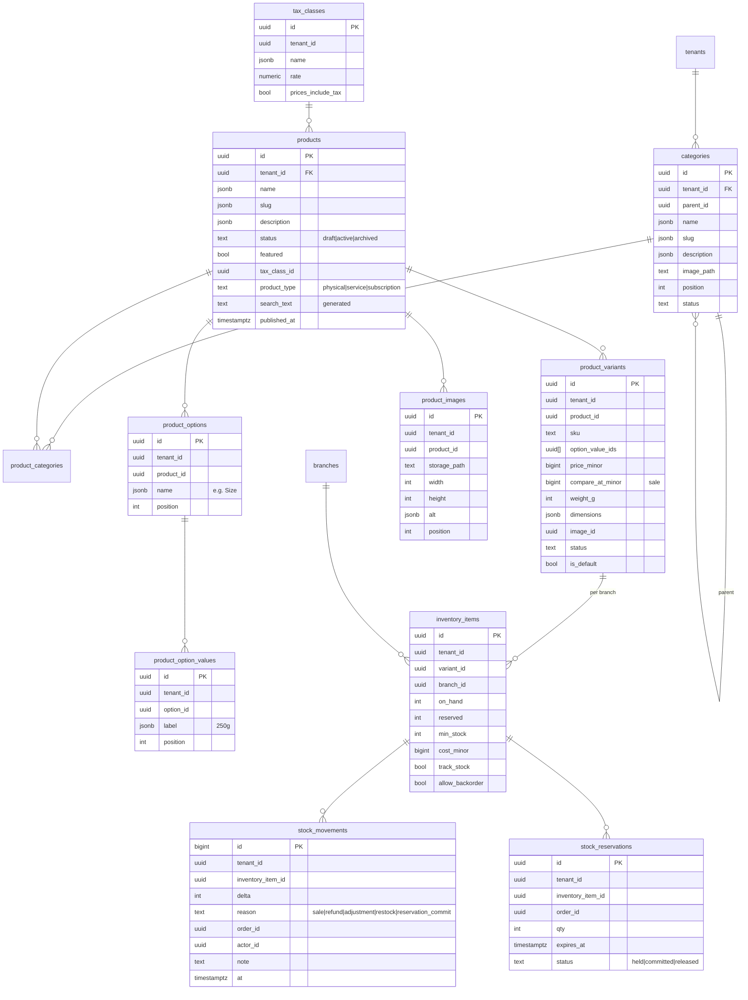
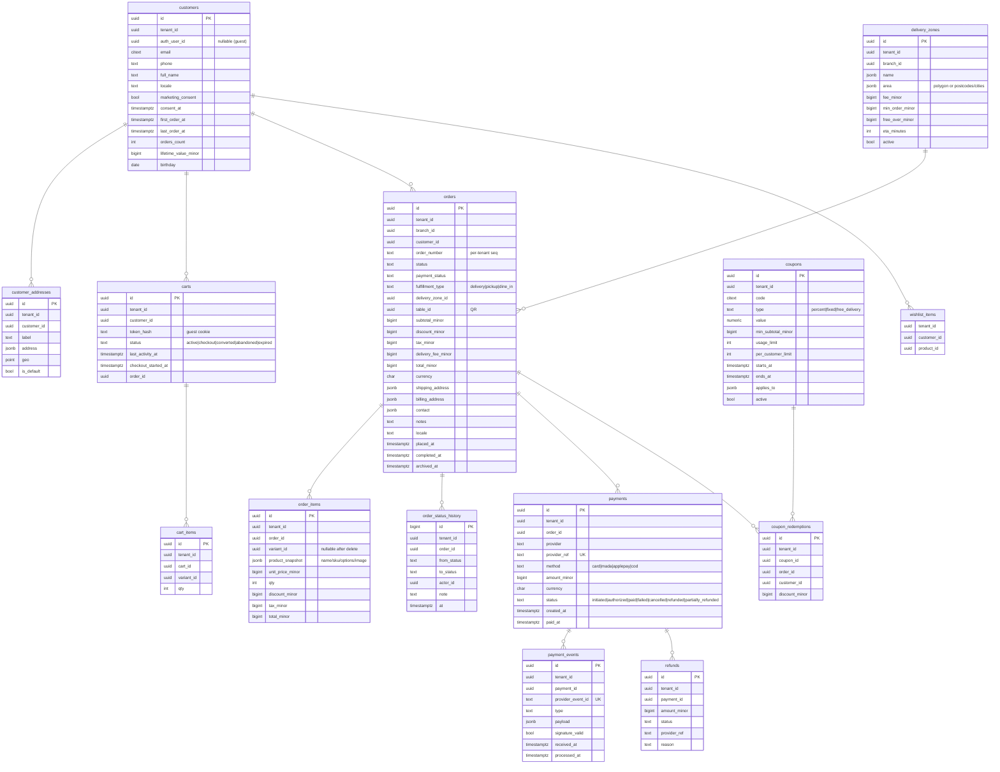

# SmartManager E-commerce — Architecture Plan (Phase 0)

Status: **Approved (2026-09-25) with one change: deployment on Hostinger instead of Cloudflare.** Platform domain: `e-commerce.smartmanager.me`. Phase 1 is implemented; see §17.
Date: 2026-09-25

---

## 1. Audit findings

| Area | Finding | Consequence |
|---|---|---|
| Git repository | Empty (no commits, no `package.json`, no code). | Greenfield. Nothing to preserve or migrate. |
| Supabase project | `E-commerce` (`yswvehtpwmzulgkvznnb`), region `ap-south-1`, Postgres 17, status healthy. No `public` tables, no migrations, no storage buckets, no auth users. | Clean database, so the schema can be designed properly from migration 0001. |
| Installed extensions | `pgcrypto`, `uuid-ossp`, `supabase_vault`, `pg_stat_statements` | Vault will hold tenant payment secrets. |
| Available extensions to enable | `pg_trgm`, `citext`, `btree_gist`, `pg_cron`, `pgmq`, `pgtap`, `unaccent` | Search, case-insensitive email, booking overlap constraints, scheduled jobs, queues, and DB security tests. |
| Other Supabase projects in org | `SmartManager Loyalty`, `Sales CRM`, `smartmanager-projects`, `Affiliate` | Not reused. Integration can come later through APIs; data is not shared across projects. |
| Environment variables | None configured (no Supabase URL/keys, DB password, payment, or Cloudflare credentials). | See §13, *Missing configuration*. |
| Tooling in dev container | Node 22, npm 10, pnpm 10, psql, Docker | Supabase CLI local stack + pgTAP tests + Playwright are all viable. |

**Conflicts found:** none (greenfield).
**Region note:** `ap-south-1` (Mumbai) is a reasonable latency choice for the Gulf. Supabase has no Middle East region. If data residency in KSA becomes a legal requirement, it will need a separate decision.

---

## 2. Technology decisions

| Concern | Decision | Why |
|---|---|---|
| Framework | **Next.js (App Router, latest stable) + React Server Components + TypeScript (strict)** | SSR/ISR for a fast, SEO-friendly storefront. Server Actions and Route Handlers serve as the server-side service layer. |
| Styling | **Tailwind CSS v4** with CSS-variable design tokens | Tokens are driven by the theme and tenant at runtime with no rebuild per tenant. Logical properties (`ms-*`, `pe-*`, `start-*`) give correct RTL. |
| i18n | **next-intl**, locale as a URL prefix: `/en/...`, `/fr/...`, `/ar/...` | SEO-correct (`hreflang`, canonical). Switching language keeps the same path and query, so page state is preserved. `<html lang dir>` is set per locale. |
| DB / Auth / Storage | **Supabase** (Postgres + RLS, Auth, Storage, Vault) via `@supabase/ssr` | Required by the spec. Cookie-based sessions. |
| Validation | **Zod** at every server boundary, plus DB constraints | The client is never trusted. |
| Data access | Typed **repositories** (`src/server/repositories/*`) with **services** above them (`src/server/services/*`). Generated Supabase types. | No business logic in components. |
| Deployment | **Hostinger Business — Node.js web app, ZIP upload** (confirmed). Hostinger runs `npm run build` / `npm start`; see `docs/DEPLOYMENT-HOSTINGER.md`. Each storefront hostname is attached once in hPanel (no wildcard SSL on Business). A VPS would enable fully automatic custom domains later: tenant custom domains need on-demand TLS (e.g. Caddy `on_demand_tls` with an `ask` endpoint that checks `tenant_domains`) and a wildcard certificate for `*.e-commerce.smartmanager.me` (DNS-01). | Approved change. Managed Hostinger Node.js hosting works for platform subdomains, but each custom domain would need manual setup in hPanel. |
| Background work | **pg_cron** (schedules) + **pgmq** (queues). A secured `/api/jobs/*` worker is triggered by a server cron (Hostinger cron / systemd timer) or by `pg_net` from pg_cron. | Abandoned carts, daily brief, retention, aggregates, and notifications. |
| Charts | Recharts (admin only; lazy-loaded) | Keeps storefront JS minimal. |
| Tests | **Vitest** (unit/service), **pgTAP** (RLS and cross-tenant, run with `supabase test db`), **Playwright** (E2E, mobile viewports, RTL) | Required by §6 and §44 of the spec. |
| AI assistant | Claude API with **tool use** over a fixed set of tenant-scoped query tools. The model never writes SQL. | Tenant isolation by construction (§11). |

---

## 3. System overview

```
                 roasters.com  coffeehouse.com  cafe.smartmanager.app  app.smartmanager.app
                        \            |               /                      |
                    Reverse proxy on Hostinger (TLS, on-demand certs)       |
                                     |                                      |
                         Next.js standalone Node server ---------------------+
                         ┌───────────────────────────────────────────────────────┐
  request ─► proxy.ts:   │ hostname → TenantResolver (cached) → x-tenant-id       │
                         │ locale detection → /[locale]                            │
                         ├───────────────────────────────────────────────────────┤
                         │ Storefront (RSC)   │ Tenant Admin    │ Super Admin     │
                         │ app/(store)/[loc]  │ app/(admin)/... │ app/(platform)  │
                         ├───────────────────────────────────────────────────────┤
                         │ Service layer (server-only): Catalog, Cart, Checkout,  │
                         │ Pricing, Orders, Payments, Inventory, Booking,         │
                         │ Loyalty, Analytics, Notifications, AI, Entitlements    │
                         ├───────────────────────────────────────────────────────┤
                         │ Repositories → Supabase client                         │
                         │   • user-scoped client (JWT → RLS enforced)            │
                         │   • service client (server-only, narrow use, audited)  │
                         └───────────────────────────────────────────────────────┘
                                     │                         ▲
                         Postgres (RLS on every tenant table)   │ webhooks (signed)
                         Storage (tenant-prefixed paths)        │
                         Vault (payment secrets)          Moyasar / Tap / Stripe
```

---

## 4. Multi-tenancy model

### 4.1 Isolation strategy
- **Shared schema, `tenant_id uuid NOT NULL` on every tenant-owned table**, with RLS enabled and **forced** on all of them.
- Composite foreign keys `(tenant_id, id)` on child tables, e.g. `order_items (tenant_id, order_id) → orders (tenant_id, id)`. The database therefore rejects rows that link across tenants, even from privileged code.
- RLS helpers are `SECURITY DEFINER`, `STABLE`, with a pinned `search_path`, in a private `app` schema that is not exposed through the API:
  - `app.is_super_admin()`: platform role from the `platform_admins` table.
  - `app.is_tenant_member(tenant_id)`
  - `app.has_tenant_role(tenant_id, roles text[])`
  - `app.has_permission(tenant_id, permission text)`: role→permission mapping lives in tables, so it is extendable.
  - `app.tenant_has_feature(tenant_id, feature_key)`: plan entitlement check.
  - `app.current_customer_id(tenant_id)`: maps `auth.uid()` to that tenant's customer row.
- Standard policy shape (staff):
  `USING (app.has_permission(tenant_id, 'orders.read'))` / `WITH CHECK (app.has_permission(tenant_id, 'orders.write'))`.
- Customer policy shape: `USING (customer_id = app.current_customer_id(tenant_id))`.
- **Super admin** access goes through explicit `OR app.is_super_admin()` clauses on the tables it needs, plus audit logging. There is no blanket bypass.

### 4.2 Identity model
- `auth.users` is shared by the whole Supabase project. A person can be:
  - **staff** of one or more tenants → `tenant_members (tenant_id, user_id, role_id, branch_id?)`
  - **customer** of one or more tenants → `customers (tenant_id, auth_user_id?, …)`. The row is per tenant. Guests have `auth_user_id = NULL`.
  - **platform admin** → `platform_admins (user_id)`
- Roles: `tenant_owner`, `admin`, `manager`, `staff` are seeded system roles. Permissions are rows (`permissions`, `role_permissions`). Tenants can later create custom roles (`roles.tenant_id` not null). `super_admin` is platform-level and never a tenant role.

### 4.3 Public (storefront) data exposure
- Base tables grant **no privileges to `anon`**, with one exception: catalog tables that hold only public fields (see below) get an `anon` SELECT policy limited to `status = 'active'` rows of `active` tenants.
- **Sensitive commercial fields are in separate tables that anon can never read**: cost and stock quantities live in `inventory_items`, not on `products`/`product_variants`. The storefront gets availability through `storefront_variant_availability(tenant_id, variant_ids[])`. This function returns `in_stock`/`low_stock`/`out_of_stock` and never exposes cost or exact stock.
- The storefront always filters by the `tenant_id` that **the server resolved from the hostname**, never by a value from the client.

### 4.4 Writes from the storefront
Cart, checkout, order creation, booking creation and payment initiation run **only in server code**. The tenant comes from the resolved host. Transactional Postgres functions do the work:
- `commerce.create_order_from_cart(...)` re-reads prices, variants, coupon rules, delivery zone and tax from the DB, recomputes every amount, and creates the order and its item snapshots atomically.
- `commerce.confirm_payment(payment_id, provider_payload)` is called **only by the webhook/verification path**. It marks the payment and order paid, converts stock reservations into deductions, awards loyalty points, and updates aggregates.
- These functions are `EXECUTE`-granted to `service_role` only.

---

## 5. Domain / tenant resolution

```
request → proxy (src/proxy.ts) → normalize host (lowercase, strip port, strip "www.")
        → TenantResolver.resolve(host)
             1. edge cache / in-memory LRU (TTL 60s, tag-invalidated on domain change)
             2. SELECT tenant_id FROM tenant_domains WHERE hostname = $1 AND verified
             3. fallback: "<slug>.<PLATFORM_ROOT_DOMAIN>" → tenants.slug
             4. dev only: "<slug>.localhost", or ?__tenant=<slug> when NODE_ENV !== 'production'
        → not found → platform marketing / 404 page (never another tenant's store)
        → tenant.status = suspended → "store unavailable" page
        → sets request header x-tenant-id (overwrites any client-supplied value)
```
- `tenant_domains (hostname unique, tenant_id, is_primary, verification_token, verified_at, ssl_status)`. Custom-domain TLS on Hostinger uses on-demand certificates gated by this table (Phase 15).
- The resolver is a server-only service with a narrow read-only query over `tenant_domains` and `tenants`. It does not use broad privileges.
- The **tenant admin** is served from a central host (`app.<platform domain>`) with a tenant switcher. Reasons: a single login for staff who belong to several tenants, auth cookies are never scoped to customer-facing custom domains, and admin is never exposed on tenant domains. Visiting `/admin` on a tenant domain redirects there. **Super admin** is `app.<platform domain>/platform`, gated by `platform_admins`. *(Decision point D1 below.)*

---

## 6. Money, locale and content conventions
- **Money is stored as `bigint` minor units** (halalas, cents, millimes) together with `currency char(3)`. Currency exponent comes from a `currencies` table (SAR/EUR/USD = 2, KWD/BHD/TND = 3). There are no floats anywhere.
- **Multilingual content** uses JSONB `{ "en": "...", "fr": "...", "ar": "..." }` for `name`, `description`, `slug` and similar fields. A CHECK constraint restricts keys to supported locales. Fallback order: requested locale → tenant default language → any available locale.
- Search: `pg_trgm` GIN index on a generated, `unaccent`ed text column that concatenates all locale names and SKUs. It works for Arabic (trigram, no stemming) and French (accent-insensitive).
- Timestamps are `timestamptz`. Business logic such as opening hours, "today" and daily briefs uses `tenants.timezone`.
- UI strings live in `messages/{en,fr,ar}.json` (next-intl). No user-facing text is hard-coded in components.

---

## 7. Database schema (ERD)

Schemas: `public` (API-exposed tables with RLS), `app` (private helpers), `commerce` (private transactional functions), `analytics` (aggregates).

### 7.1 Platform, tenancy and access


### 7.2 Catalog and inventory



A product without options has exactly one default variant, so price and SKU always live on variants and there is only one code path. Sale price is `compare_at_minor` (original) versus `price_minor` (current).

### 7.3 Customers, carts, orders and payments



`promotions` (automatic discounts: rules plus `jsonb` conditions and actions) sits next to `coupons` and shares the same pricing engine.

### 7.4 Booking, loyalty, subscriptions, marketing and operations


The overlap guarantee `EXCLUDE USING gist (resource_id WITH =, period WITH &&) WHERE status IN ('pending','confirmed')` (needs `btree_gist`) makes double-booking impossible at the database level. Other operational tables: `marketing_campaigns`, `abandoned_cart_rules`, `communication_consents`, `order_exports`, `tenant_counters` (per-tenant order numbers), `currencies`.

### 7.5 Analytics aggregates (schema `analytics`)
- `daily_sales (tenant_id, branch_id, day, orders, revenue_minor, discount_minor, tax_minor, new_customers, returning_customers, aov_minor)`
- `daily_product_sales (tenant_id, day, product_id, variant_id, qty, revenue_minor)`
- `daily_category_sales`, `daily_bookings`, `daily_coupon_usage`
- **Maintenance:** incremental upsert inside `confirm_payment`, refund and cancel, plus a nightly pg_cron reconcile for the previous 2 days. Dashboards read aggregates only; "today" is computed live from indexed `orders(tenant_id, placed_at)`.
- The aggregates **survive order archival/deletion**, which is what makes the retention policy (§28 of the spec) safe.

### 7.6 Retention (spec §28)
`tenant_settings.retention = { archive_after_days, delete_after_days, require_export: true }`.
Lifecycle: active → `archived_at` set (hidden from operational lists, still exportable) → export generated (`order_exports`, file in private storage) → hard delete only after `delete_after_days`, only if an export exists, and always with an audit log row. Nothing is deleted if either value is null (the default).

---

## 8. Storage
- Buckets: `tenant-public` (product and brand images, public read) and `tenant-private` (exports, invoices; signed URLs only).
- Path convention: `{tenant_id}/{kind}/{uuid}.{ext}`. Storage RLS checks `(storage.foldername(name))[1]::uuid` against `app.has_permission(..., 'media.write')`.
- Image pipeline: the original is uploaded server-side after validation (mime sniffing, size limit). Responsive AVIF/WebP delivery uses the built-in `next/image` optimizer (sharp) running on the Hostinger Node server, with its cache on local disk. Thumbnails are generated at upload time. This replaces D4 (Cloudflare Images) after the move to Hostinger.

---

## 9. Payments

```ts
interface PaymentProvider {
  key: 'moyasar' | 'tap' | 'stripe' | 'cod';
  supportedMethods(cfg): PaymentMethod[];              // card, mada, applepay, stcpay...
  createPayment(input: CreatePaymentInput, secrets): Promise<ProviderPaymentSession>;
  fetchPayment(ref: string, secrets): Promise<ProviderPaymentStatus>;   // server-side verification
  verifyWebhook(req: RawRequest, secrets): Promise<VerifiedEvent>;      // signature check
  refund(ref: string, amountMinor: bigint, secrets): Promise<RefundResult>;
  applePay?: { domainAssociation(cfg): string };        // served at /.well-known/...
}
```
- `PaymentService` picks the tenant's active `payment_provider_configs` row. Secrets are read from **Supabase Vault** by a `service_role`-only function, in server code only.
- Flow: checkout → `create_order_from_cart` (status `pending_payment`, stock reserved with a 15-minute expiry) → `createPayment` → provider-hosted or official SDK form (Moyasar.js / Apple Pay via the provider) → redirect back. **The return page only displays status.** It calls `fetchPayment` server-side, while the webhook also arrives (`/api/webhooks/payments/[provider]/[configId]`). Both paths call the idempotent `confirm_payment`, keyed on `provider_event_id` / `provider_ref` plus an amount and currency match check.
- Failure, cancel or expiry releases reservations. A pg_cron job sweeps expired reservations.
- **First provider: Moyasar** (KSA, SAR, Mada, Apple Pay, STC Pay). Tap and Stripe are adapters behind the same interface. *(Decision point D2.)*
- Apple Pay is enabled only when the provider supports it and domain verification is done per tenant domain. No fake buttons.
- Card data never touches our servers (provider-hosted fields/tokenization).

---

## 10. Theme engine and design system
- **Design tokens** (`src/design/tokens.ts` → CSS variables): color roles (`--color-bg`, `--color-fg`, `--color-primary`, `--color-accent`, `--color-muted`, `--color-border`, …), type scale, font families (Latin and Arabic pairing per theme, e.g. serif display + IBM Plex Sans Arabic / Noto Naskh), spacing scale, radius scale, shadows, motion durations.
- **Theme** = `{ key, tokens, fonts, variants: { header, hero, productCard, button }, defaultSections }`. It is registered in `src/themes/registry.ts`. The five themes are `premium-cafe`, `modern-restaurant`, `modern-retail`, `luxury` and `beauty`. New themes are added through registration only.
- **Tenant overrides** come from `storefront_configs.tokens` and are merged over the theme defaults, validated with Zod (colors are checked for WCAG contrast before saving).
- **Homepage** = an ordered array of `{ type, enabled, variant, props }` validated against a section registry (hero, featured-categories, best-sellers, featured-products, promo-banner, brand-story, collection, reviews, loyalty, newsletter, location, booking-cta). Admins reorder and toggle sections.
- Components: headless primitives (Radix UI for dialog, drawer, popover, select and focus-trap accessibility) with our own styling. No generic UI kit look.

---

## 11. AI business assistant (architecture; built in Phase 13)
- Route handler → authenticate the staff user → resolve the active tenant from the session membership (**never from the prompt**) → Claude with a fixed toolset: `get_sales_summary(range)`, `top_products(range, limit)`, `low_stock()`, `inactive_customers(days)`, `compare_periods(a, b)`, `category_performance(range)`.
- Each tool runs through the **user-scoped Supabase client**, so RLS applies. The tenant is bound in the closure; the model cannot choose it. Tool output is aggregate-first, and PII is minimized.
- The model only drafts promotion ideas. Creating a promotion requires explicit admin confirmation in the UI.
- Gated by the `ai_assistant` feature entitlement. Usage is logged per tenant.

---

## 12. Security checklist (built into Phase 1–2, verified in Phase 14)
- RLS enabled and **forced** on every `public` table. A CI check fails if any table lacks RLS.
- pgTAP suite: for each tenant-owned table, Tenant A's owner/staff/customer cannot SELECT, INSERT, UPDATE or DELETE Tenant B's rows. Anon cannot read private tables. Tenant staff cannot touch `platform_*` tables. Composite foreign keys reject cross-tenant links.
- The service-role key is only imported in modules marked `import 'server-only'`. An ESLint rule blocks `SUPABASE_SERVICE_ROLE_KEY` from any client file, and env validation (`@t3-oss/env-nextjs` + Zod) separates server and client variables.
- Price, discount, tax, stock, tenant, role and payment status are always computed or read server-side.
- Webhook signature verification plus idempotency; rate limiting on auth, checkout, booking and coupon endpoints (reverse-proxy rate limiting plus an application/DB-backed limiter; Supabase Auth already rate-limits sign-in).
- Security headers (CSP with provider allowlist, HSTS, frame-ancestors, referrer-policy); SameSite=Lax, HttpOnly, Secure cookies; Server Actions' built-in origin check for CSRF, plus an origin check on route handlers.
- Audit log for admin writes (DB triggers on sensitive tables plus service-level events).

---

## 13. Missing configuration / credentials

| Item | Needed by | Notes |
|---|---|---|
| `NEXT_PUBLIC_SUPABASE_URL` = `https://yswvehtpwmzulgkvznnb.supabase.co` | Phase 1 | Known. |
| Supabase publishable (anon) key | Phase 1 | Retrievable through the Supabase MCP. |
| **Supabase service-role / secret key** | Phase 1 (server) | **Must be provided** as an environment secret. The MCP cannot reveal it, and it will not be committed. |
| DB connection string / password | Local migration tooling (optional) | Migrations can be applied through the Supabase MCP instead. |
| Platform root domain (e.g. `smartmanager.app`) | Phase 2 | For `<slug>.<root>` subdomains and the admin host. |
| Moyasar test keys (publishable + secret + webhook secret) | Phase 6 (built; not yet entered) | Per tenant, via Console → Settings → Payments; stored in Vault, not an env var. Needed to verify a real payment end to end. |
| Apple Pay merchant/domain setup | Deferred past Phase 6 | Needs a live HTTPS domain; add once deployed. |
| Email provider (Resend is connected to this workspace) + sending domain | Phase 7 | Order notifications, daily brief. |
| WhatsApp Business provider | Phase 10 (optional) | Architecture only until credentials exist. |
| Gemini (Google AI Studio) API key **or** Anthropic API key | AI Operating System | Server-only. Gemini is preferred when set (free tier); either alone is enough to turn AI features on. |
| Hostinger plan details (VPS recommended), SSH/deploy access, DNS for `e-commerce.smartmanager.me` and `*.e-commerce.smartmanager.me` | Phase 15 | Wildcard DNS + certificate; on-demand TLS for custom domains. |
| Supabase plan (image transformations and PITR backups need Pro) | Phases 4/15 | |

---

## 14. Repository layout (target)

```
/
├─ src/
│  ├─ app/
│  │  ├─ (store)/[locale]/...          storefront: home, shop, product/[slug], cart, checkout, account, book
│  │  ├─ (admin)/[locale]/admin/...    tenant admin
│  │  ├─ (platform)/[locale]/platform/ super admin
│  │  └─ api/ (webhooks, jobs, health)
│  ├─ proxy.ts                         tenant + locale resolution (Next.js 16 "proxy")
│  ├─ i18n/ (routing, request config)   messages/{en,fr,ar}.json at root
│  ├─ design/ (tokens, primitives)      components/{ui,store,admin}/
│  ├─ themes/ (registry + 5 themes)     sections/ (homepage section registry)
│  ├─ server/ (server-only)
│  │  ├─ supabase/ (user client, service client)
│  │  ├─ tenant/ (resolver, context)
│  │  ├─ repositories/   services/   payments/providers/
│  │  └─ env.ts
│  └─ lib/ (money, locale, zod schemas, shared types)
├─ supabase/
│  ├─ config.toml
│  ├─ migrations/0001_… .sql
│  ├─ seed.sql                          Tenant A (café), Tenant B (retail) dev data
│  └─ tests/*.test.sql                  pgTAP RLS / isolation tests
├─ tests/ (vitest unit, playwright e2e)
└─ docs/ (ARCHITECTURE.md, decisions/ADR-*.md, RUNBOOK.md)
```

---

## 15. Phase 1 — Foundation (proposed plan)

**Build:** Next.js + TypeScript (strict) + Tailwind v4 scaffold; design tokens; next-intl with en/fr/ar and RTL; Supabase clients (browser/server/service) and env validation; auth foundation (email+password and magic link, session middleware); tenant resolver; storefront shell (header, footer, language switcher, theme token injection); admin shell (sidebar nav driven by entitlements, empty states); CI scripts (typecheck, lint, test, RLS check).

**Migrations:**
1. `0001_extensions_and_private_schemas.sql`: `pg_trgm`, `citext`, `btree_gist`, `unaccent`; `app`, `commerce` and `analytics` schemas; shared `updated_at` trigger.
2. `0002_platform_and_tenancy.sql`: `currencies`, `tenants`, `tenant_domains`, `tenant_settings`, `storefront_configs`, `branches`, `profiles` (+ auth trigger), `platform_admins`, `roles`, `permissions`, `role_permissions`, `tenant_members`.
3. `0003_plans_and_entitlements.sql`: `features`, `plans`, `plan_features`, `tenant_subscriptions`, `tenant_feature_overrides`.
4. `0004_rls_helpers_and_policies.sql`: `app.*` helper functions and RLS policies for the tables above.
5. `0005_audit_log.sql`
6. `seed.sql`: system roles and permissions, features, three plans (Starter/Business/Professional as data), Tenant A “Roasters Café” (`roasters.localhost`), Tenant B “Coffeehouse” (`coffeehouse.localhost`), dev users.
7. `supabase/tests/0001_tenancy_isolation.test.sql` (pgTAP).

**Dependencies:** `next`, `react`, `react-dom`, `typescript`, `tailwindcss`, `@tailwindcss/postcss`, `next-intl`, `@supabase/supabase-js`, `@supabase/ssr`, `zod`, `@t3-oss/env-nextjs`, `server-only`, `@radix-ui/react-*` (as needed), `clsx`, `tailwind-merge`; dev: `eslint`, `eslint-config-next`, `prettier`, `vitest`, `@playwright/test`, `supabase` (CLI).

Catalog, orders and the other domain tables are **not** created in Phase 1. They arrive in their own phases, with the ERD above as the target.

---

## 16. Decision points for approval

- **D1: Admin host.** Proposed: central `app.<platform domain>` for tenant admin and `/platform` for super admin, with `/admin` on tenant domains redirecting there. Alternative: admin on each tenant domain.
- **D2: First payment provider.** Proposed: **Moyasar** (KSA-native, Mada + Apple Pay + STC Pay). Alternatives: Tap, Stripe.
- **D3: URL locale prefix.** Proposed: always prefixed (`/ar/...`), with the default locale redirected from `/` by tenant default and `Accept-Language`.
- **D4: Image transformations.** ~~Cloudflare Images~~ → built-in `next/image` optimizer on the Hostinger Node server (follows from the Hostinger decision).
- **D5: Branches.** Proposed: every tenant gets a hidden default branch, so branch-scoped data is uniform. Multi-branch UI appears only with the entitlement.
- **D6: Database workflow.** Proposed: migrations are versioned in `supabase/migrations`, tested locally with the Supabase CLI (Docker) plus pgTAP, then applied to the `E-commerce` project through the Supabase MCP. The remote project is treated as dev/staging; production gets a separate project in Phase 15.

---

## 17. Phase 1 implementation notes

**Hosts** (configurable with `PLATFORM_ROOT_DOMAIN` / `CONSOLE_SUBDOMAIN`):

| Host | Area | Internal route |
|---|---|---|
| `e-commerce.smartmanager.me` | Platform site | `/site/[locale]/…` |
| `app.e-commerce.smartmanager.me` | Tenant admin console + Super Admin (`/platform`) | `/console/[locale]/…` |
| `<slug>.e-commerce.smartmanager.me` | Storefront (tenant by slug) | `/store/[tenant]/[locale]/…` |
| any verified custom domain | Storefront (tenant by `tenant_domains`) | `/store/[tenant]/[locale]/…` |
| development | `localhost:3000`, `app.localhost:3000`, `<slug>.localhost:3000` | same |

- `src/proxy.ts` is the only place where hostname → area/tenant is decided. It strips client-supplied internal headers (`x-tenant-id`, …) and rewrites to internal routes. Visitors cannot address `/store/<other-tenant>` directly, because every path is prefixed by the proxy. Redirects are built from the visitor's `Host` header and `X-Forwarded-Proto`, so they stay correct behind Hostinger's reverse proxy.
- Locale: the URL prefix is authoritative. Without one, the proxy picks the `NEXT_LOCALE` cookie, then `Accept-Language`, then the tenant default, always restricted to the tenant's enabled languages.
- App Router layouts and pages render in parallel, so every console page calls `requireTenantAdmin()` itself; access checks are never left only to a layout.
- Themes: `src/themes/definitions.ts` (5 themes), `src/themes/tokens.ts` (CSS variables, validated tenant overrides, automatic contrast-safe `*-text` colours and readable foregrounds).

**Database migrations:** `supabase/migrations/20260925000001…07`. They are applied to the hosted dev project with the same SQL, and the two dev tenants are seeded there (no users).

**Tests:**
- `npm run test:db`: pgTAP (59 assertions) covering RLS coverage, privileges, and cross-tenant isolation for owner/manager/staff/outsider/anon/platform admin.
- `npm test`: Vitest (hosts, locales, money, localisation, themes/contrast, module visibility, translation parity).
- `npm run test:e2e`: Playwright (desktop, Android-size and iPhone-size viewports; RTL, tenant isolation, SEO tags, axe accessibility).

---

## 18. Phase 2 implementation notes (multi-tenancy management)

**Migration `20260926000008_tenant_management`:**
- `tenant_invitations`: 256-bit tokens, stored only as SHA-256 hashes (clients cannot read `token_hash`), 7-day expiry, one open invitation per email per tenant, audited.
- `invite_member` / `revoke_invitation` / `get_invitation` (anon, token-gated) / `accept_invitation` (the signed-in user's email must match). The `max_staff` entitlement counts active members plus open invitations, and is also enforced when a disabled member is re-enabled.
- Only owners can invite owners, and admins with `staff.write` can invite other roles. Membership changes stay owner-only (RLS plus the last-owner guard).
- Platform RPCs (Super Admin only, checked inside): `platform_create_tenant` (tenant, trial subscription and owner invitation in one transaction), `platform_set_plan`, `platform_invite_owner`.
- Custom domains: tenants with `settings.write` and the `custom_domain` entitlement can request unverified domains only. Verification is a server-side DNS TXT check (`_smartmanager-verify.<host>`), recorded by `record_domain_check` (service role only, with the actor attributed in the audit log). `hosting_connected_at` tracks the manual hPanel step.
- Storage: public bucket `tenant-public` (5 MB, raster images only). Writes are limited to `<tenant_id>/…` folders for members holding `media.write`/`appearance.write`. Uploads are re-encoded with sharp; SVG is rejected.

**Console modules:** Settings (profile, languages, contact, domains), Appearance (theme, contrast-checked colours, logo/favicon), Staff (invite, roles, disable, remove), invitation acceptance, and Super Admin (create business, status, plan, per-tenant feature overrides, hostname checklist, owner re-invite). Each page enforces permission and entitlement itself (`ModuleGate`); Server Actions re-check with `actionContext()`, and the database enforces RLS as the last line.

**Email:** as of Phase 7, invitations are emailed via Resend (see §23); the console still shows and lets you copy the same link as a fallback. Invitees create their account through the invitation (created server-side for the invited email only).

---

## 19. Phase 3 implementation notes (storefront design system)

- **Design system:** documented in `docs/DESIGN-SYSTEM.md` (tokens, themes, components, sections, states).
- **Migration `20260926000009_storefront_newsletter`:** `newsletter_subscribers` (consent timestamp and source, unique per tenant+email, staff with `marketing.read` can read). `newsletter_subscribe()` is service-role only and accepts active stores only. `resolve_storefront` now also returns the default branch's opening hours.
- **Storefront writes** (newsletter) take the tenant from the request **Host** (`requestStorefrontTenant()`), never from route params or form fields. They are rate-limited per IP (in-process limiter, suitable for one Node process on Hostinger) and use a honeypot field.
- **SEO:** LocalBusiness/Organization JSON-LD with the schema.org type chosen by business type, address and opening hours. Host-aware `robots.txt` (console and platform are not indexable) and `sitemap.xml` with hreflang alternates.
- **Forms:** `useActionForm` prevents React 19's automatic form reset, so a server-side validation error no longer wipes the user's other inputs. Forms still submit without JavaScript.
- **Images:** section photos are re-encoded to WebP (max 2400 px) at upload. `next/image` serves responsive AVIF/WebP. Optimising images from private IPs is enabled only when Supabase runs locally.

## 20. Phase 4 implementation notes (products & inventory)

- **Migration `20260926000010_catalog_inventory`:**
  - Tables: `categories` (tree with a cycle guard), `products`, `product_categories`, `product_options` (up to 3), `product_option_values`, `product_images`, `product_variants`, `inventory_items` (one per variant per branch) and `stock_movements` (ledger).
  - Every table uses composite `(tenant_id, id)` foreign keys, so rows cannot be linked across tenants.
  - Image paths are constrained to the tenant's own storage folder.
- **Derived data is database-owned:**
  - `price_min_minor` / `price_max_minor` (from active variants), `search_text` (normalised names, slug and SKUs; Latin accents, Arabic diacritics and letter variants are ignored) and `published_at` are maintained by triggers.
  - Clients have column-level grants that exclude these columns, and `tenant_id` / `id` cannot be updated.
- **Stock:**
  - `on_hand` is never writable by clients. Every change goes through `adjust_stock()`, which checks `inventory.write`, rejects negative stock unless backorders are allowed, and writes a `stock_movements` row with the acting user.
  - Staff may only use manual reasons (initial, restock, adjustment, damage, correction). Sales, refunds and reservations are reserved for server code with the service role (Phase 5).
  - Stock is tracked by default only when the plan includes `inventory`.
  - Cost (`cost_minor`) lives only in `inventory_items`, which anonymous visitors cannot read.
- **Product editor:**
  - `save_product_structure()` saves options, values and variants in one transaction.
  - It runs as SECURITY INVOKER, so RLS (`catalog.write`) still applies, and opening stock goes through `adjust_stock()`.
  - Variants that are removed are archived, not deleted, so future orders keep their history. SKUs are unique among a tenant's active variants.
  - `max_products` is enforced by a trigger (error 53400).
- **Storefront reads:**
  - `storefront_catalog` (search, category subtree, price range in minor units, availability, sort, pagination ≤ 60), `storefront_product`, `storefront_categories` and `storefront_sitemap`.
  - They return only active products of active stores, and availability only as a status (`in_stock` / `low_stock` / `out_of_stock`), never quantities or cost.
- **Routes:**
  - Storefront: `/[locale]/shop`, `/[locale]/shop/[category]` (filters are a GET form with shareable URLs; filtered URLs are `noindex`) and `/[locale]/products/[slug]` (Product + BreadcrumbList JSON-LD).
  - Console: `products` (list, new, editor), `categories` (list, editor) and `inventory` (list, low-stock filter, item page with adjustment, settings and history). The dashboard shows live catalog and low-stock figures.
- **Ordering is not live yet.** The product page states that online ordering opens soon and offers the store's phone or email; there is no cart button. The cart and checkout come in Phase 5.
- **Homepage sections:**
  - Featured products, featured categories and product collection are now available.
  - Best sellers stays locked until real order data exists.
- **Uploads:** product and category photos (PNG/JPEG/WebP, ≤ 8 MB each) are re-encoded to WebP (max 2000 px). Server Action and proxy body limits are raised to 20 MB (`next.config.ts`).

## 21. Phase 5 implementation notes (cart, checkout & orders)

- **Migration `20260927000011_orders_checkout`:**
  - Tables: `tenant_counters` (per-tenant order numbers), `delivery_zones`, `customers`, `carts` / `cart_items` (guest cart, keyed by a **hashed** random cookie token — never the raw token), `orders`, `order_items` (price/name snapshots), `order_status_history`, `payments` (pay-on-fulfillment only; online providers arrive in Phase 6).
  - `tenant_settings.checkout` / `.tax` gain a validation trigger and a `app.commerce_settings()` reader with safe defaults (ordering is **off** until the owner turns it on).
- **Nothing priced or trusted comes from the browser:**
  - The storefront cart, quote, checkout and order-status reads/writes are `service_role`-only Postgres functions (`cart_update`, `cart_view`, `checkout_quote`, `create_order_from_cart`, `storefront_order`, `storefront_checkout_options`, `storefront_best_sellers`), called from server code with the tenant resolved from the request Host — never a client-supplied id.
  - `create_order_from_cart` re-reads every price, re-checks every stock line, and recomputes the subtotal, delivery fee, tax and total inside one transaction; the browser only ever sends a variant id/quantity (cart) or contact/fulfillment details (checkout).
  - VAT: `tax_rate_bps` (0–10000) and `tax_included` come from `tenant_settings.tax`; the total is computed once, server-side, and stored on the order so it never drifts if the setting changes later.
- **Stock reservation, not double-booking:**
  - Placing an order **reserves** stock (`inventory_items.reserved`) for tracked variants; it is never deducted at checkout.
  - `update_order_status()` deducts reserved stock into the ledger (`stock_movements`, reason `sale`) only when an order reaches `completed`, and releases the reservation on `cancelled`. A guard trigger stops staff from manually lowering `on_hand` below what is currently reserved (unless backorders are allowed).
  - Concurrent carts for the same variant are re-checked and capped against real availability both when adding to cart and again, row-locked, when the order is placed.
- **Order workflow:** `pending → confirmed → preparing → (ready | out_for_delivery) → completed`, or `cancelled` from any open state. `update_order_status()` enforces the transition table (`app.allowed_next_statuses`) and records every change (`order_status_history`), gated by `orders.write`.
- **Customers:** one row per tenant + email, created/updated at checkout (name, phone, marketing consent with a timestamp); `orders_count` and `lifetime_value_minor` are updated when an order completes. Staff read them with `customers.read`; there is no direct write path (they only change through the checkout and order functions).
- **Customer order tracking:** `/orders/<number>?t=<token>` is reachable only with the private link handed back at checkout (the token is hashed the same way as the cart cookie); the wrong token or another store's order number returns 404, never another customer's order.
- **Storefront:**
  - `/cart` (line items with live prices/availability, quantity as a plain `<form>` so it works without JavaScript) and `/checkout` (fulfillment choice, delivery zone with live fee/minimum, VAT breakdown, contact form) are only offered when `storefront_checkout_options().ordering_open` is true; otherwise the product page and checkout both say ordering isn't available yet, honestly, with no cart button.
  - Cart identity is a random token in an HttpOnly, `SameSite=Lax` cookie scoped to the tenant's own host; only its SHA-256 hash reaches the database.
  - Add-to-cart, cart updates and checkout are rate-limited per IP; checkout has a bot honeypot field.
  - The best-sellers homepage section is now unlocked: it ranks products by units sold in the last 90 days and hides itself until a store has any completed sales.
- **Console:**
  - **Orders** (`orders` module, now built): list with an open/completed/cancelled/all filter and a search by order number, name, email or phone; a detail page with the next-status actions, a "record payment" form (cash/card terminal/bank transfer), delivery address, customer notes and the full status history. Auto-refreshes while visible.
  - **Customers** (`customers` module, now built): list with search, and a detail page showing lifetime value, marketing consent and order history.
  - **Settings → Checkout & delivery**: accepting orders, pickup/delivery toggles, pay-on-fulfillment, minimum order, VAT rate/inclusion/registration number, and delivery zones (fee, minimum, free-over threshold, ETA).
  - The dashboard now shows live revenue/orders today, open and pending order counts, and a recent-orders list, alongside the Phase 4 catalog/stock figures.
- **Online payments are not built yet.** `payments.provider` only accepts `'manual'`; a manual payment is recorded by staff after the customer pays on pickup/delivery. Moyasar (or another provider) arrives in Phase 6, behind the same `orders`/`payment_status` model.

## 22. Phase 6 implementation notes (online payments — Moyasar)

- **Migration `20260928000012_online_payments`:**
  - `payment_provider_configs` (one row per tenant + provider): `mode` (test/live), `public_config` (publishable key — safe to read back), `secret_vault_id`/`webhook_secret_vault_id` (references into **Supabase Vault**, never a plain column), `methods[]`, `is_active`. RLS: staff read with `settings.write`; there is no insert/update/delete policy at all — every write goes through `save_payment_provider()`.
  - `orders` gains `expires_at` (the payment hold) and `payment_intent_ref` (the provider's reference, unique); `status` gains `pending_payment`; `payment_method` gains `'online'`. `payments` gains `provider_ref`/`provider_event_id` (unique per provider, for webhook idempotency) and accepts `provider = 'moyasar'` with methods `card|mada|applepay|stcpay`.
- **Card data never touches our servers.** Moyasar's Invoices API returns a hosted payment page; the customer is redirected there and back. Our server only ever holds the provider's secret key (decrypted from Vault, in-memory, for the duration of one outbound call) and a payment reference.
- **The single source of truth for "is this paid": `confirm_online_payment()`.** Idempotent (keyed on `provider` + `provider_event_id`, and short-circuited if the order is already paid), amount/currency-checked against the order's own `total_minor`/`currency` (never the caller's claim alone), security-definer, `service_role`-only. Both the customer's return page (`/orders/<number>/pay/return`, which re-fetches the payment from Moyasar server-side before calling it — the redirect's query string is never trusted) and the Moyasar webhook (`/api/webhooks/payments/moyasar`, HMAC-equivalent shared-secret verified) call this same function, so whichever arrives first wins and the other is a no-op.
- **Reservation, not a charge, while payment is pending.** `create_order_from_cart` gets an online-payment branch: when the checkout's `payment_method` is `'online'` and the tenant has an active provider, the order is created `pending_payment` with stock reserved (identical reservation mechanics to Phase 5) and a 15-minute `expires_at` hold, instead of the immediate `'pending'` a pay-on-fulfillment order gets. A `pg_cron` job (`app.expire_pending_payments()`, every minute) cancels and releases the reservation on anything left unpaid past its hold. Staff can only cancel a `pending_payment` order (`app.allowed_next_statuses`) — never hand-advance it — until `confirm_online_payment()` moves it to the normal `pending` state, at which point the rest of the Phase 5 workflow is unchanged.
- **Ordering can now open on either payment path.** `app.commerce_settings()` adds `online_payment` (true when an active provider config exists); `ordering_closed` now only fires when *neither* pay-on-fulfillment nor online payment is available. The checkout page offers a radio choice between the two only when both are configured; otherwise it shows the one that is, honestly, with no fake "coming soon" copy once Moyasar is live.
- **Console → Settings → Payments:** the owner pastes Moyasar's publishable key, secret key and webhook secret token (test or live mode), picks accepted methods, and turns it on. `save_payment_provider()` is permission-checked (`settings.write`) and Vault-backed; leaving a secret field blank keeps the one already stored, and a saved secret is never rendered back — the page only ever shows a "configured" state.
- **What Phase 6 does not include yet:** Apple Pay (needs per-domain merchant verification against a live HTTPS domain — deferred until deployment), and a console "issue refund" action (the provider adapter exposes `refund()` in its interface for a future pass, but no UI calls it yet — a refund today is recorded the same manual way as before). Live end-to-end verification (an actual Moyasar test-mode charge, redirect and webhook) requires a real Moyasar test account and outbound network access to `api.moyasar.com`, neither of which exist in the sandboxed build/test environment; what is verified there is everything up to and including the honest failure path (a `pending_payment` order, a clear "awaiting payment" UI, and a retry link) when the provider call itself cannot succeed.

## 23. Phase 7 implementation notes (notifications: transactional email + daily brief)

- **Migration `20260929000013_notifications`:** `tenant_settings.notifications = { order_emails, daily_brief, recipient_email }` (validated trigger, safe defaults — both on, recipient defaults to the tenant's own email) via `public.notification_settings()`. A `notifications` delivery log (tenant-scoped, staff-readable with `settings.read`, written only by the service role after an actual send attempt — never faked, never pre-recorded as "sent"). `notification_daily_briefs (tenant_id, sent_on)` is the idempotency key for the daily brief: at most one per tenant per **its own local calendar day**, enforced by a unique constraint, not by how often the sender is invoked.
- **Email is sent from server code, never from Postgres.** `src/server/notifications/resend.ts` calls the Resend API directly (`RESEND_API_KEY`/`RESEND_FROM_EMAIL`); without both configured, sending is skipped and logged as `skipped: not_configured` — never faked as sent. Templates (`src/server/notifications/templates.ts`) are localized in en/fr/ar for customer- and owner-facing mail (order placed, status changed, payment received, daily brief), and English-only for purely internal, staff-facing mail (a new staff invitation, a platform owner invitation) whose recipient's language preference isn't known before they've ever signed in.
- **The order-tracking link only appears once.** The customer's private `/orders/<number>?t=<token>` link can only be built at the moment of checkout — only the token's *hash* is ever stored, by design (Phase 5). So `order_placed` (sent right after `create_order_from_cart` succeeds, still holding the raw token) is the only email with that link; `order_status_changed` and `payment_received` (both staff-triggered, or triggered by a payment confirming later, in a different request) state the update in plain text with no link. This is a deliberate trade-off, not an oversight — regenerating a fresh token to attach a link to a later email would invalidate the customer's original bookmark.
- **When each order email fires:** `order_placed` — always, right after the order is created (pay-on-fulfillment or online, paid or not yet). `new_order_staff` — at the point the order is actually real and actionable: immediately for pay-on-fulfillment, but only once an online payment is confirmed (a `pending_payment` order that never gets paid never alerts the store). `payment_received` — a staff-recorded manual payment, or an online payment confirming. `order_status_changed` — every staff-driven transition. All four respect the tenant's `order_emails` toggle; all four degrade to a logged `skipped` entry, never an error the customer or staff would see, if there's no recipient address or email isn't configured.
- **Daily brief:** `public.daily_brief_summary()` computes yesterday's figures (orders, revenue, new customers, open orders, low-stock count) in the tenant's own time zone; `public.tenants_due_daily_brief()` returns which tenants are due one right now. `POST /api/jobs/daily-brief` (bearer-secured with `JOBS_SECRET`) sends to everyone due and records the day — safe to call as often as a cron likes; idempotency is the database's job, not the caller's. Per ARCHITECTURE.md §36's own design, this is triggered by an external cron (Hostinger cron / systemd timer hourly), not by `pg_cron`/`pg_net` calling back into the app — the two containers (Postgres, Next.js) aren't guaranteed reachable from each other the same way in every deployment, and a plain host cron is simpler to reason about and to test.
- **Invitations now email, but the link still shows too.** Staff and platform-owner invitations send an email with the accept link; the console still displays and lets you copy the same link (inbox delivery can be slow, or email may not be configured yet) — the copy changed from "share this link" to "we've emailed this; you can also share the link directly."
- **What Phase 7 does not include:** abandoned-cart emails, marketing campaigns, WhatsApp/SMS channels (`notifications.channel` only accepts `'email'` today) — all architecture-planned, not this phase's scope.

## 24. Dine-in foundation and the commerce service layer

- **Migration `20260930000014_tables_and_service_layer`** adds the dine-in half of the order model: `branches → tables → table_sessions → orders → order_items`. A `tables` row is a physical table at a branch; a `table_sessions` row is one seated visit (open → closed/cancelled) and may carry several orders ("rounds") — a unique index guarantees at most one **open** session per table. `orders` gains `table_session_id` and `fulfillment_type = 'dine_in'`; `contact` becomes optional (and its check constraint enforces the opposite) only for dine-in, since a staff-built table order has no guest checkout form behind it.
- **Dine-in orders are staff-built, not cart-based** — there's no browser cart on the other side of a table. `public.create_dine_in_order(tenant, session, items, notes)` takes only `{variant_id, qty}` pairs and computes everything else itself: it locks the referenced inventory rows, prices each line from the live `product_variants.price_minor` (never a caller-supplied price), applies the same VAT settings (`app.commerce_settings`) as the storefront, reserves stock exactly like an online order, and inserts one `orders` + N `order_items` rows. It shares `app.allowed_next_statuses`/`update_order_status`/`record_order_payment` with every other order — a dine-in order is confirmed, completed or paid through the identical staff workflow, not a separate one. `close_table_session` refuses to close while any order on it is still open (not `completed` or `cancelled`), so a table can't be freed with an unpaid round still outstanding.
- **The commerce service layer (`src/server/services/`)** is the single boundary any caller — console UI, storefront, and eventually an AI tool-calling layer — uses to act on tenant data: `products`, `inventory`, `carts`, `customers`, `tables` (tables + table sessions + dine-in orders), `orders` (status/payment), `payments` (re-exports the Phase 6 Moyasar service), and, since Phase 8, `bookings` (booking resources + the confirm/reject/complete workflow). Every function wraps a permission-checked database function or an RLS-scoped read; there is no separate, weaker path for automation. Each takes a `TenantAdminContext` (staff, resolved from a real signed-in session via `requireTenantAdmin`) or an `ActiveStorefrontTenant` (a customer, resolved from the request's own Host header) as its first argument — a future AI agent gets exactly the access the human it's acting for already has, never a tenant id or permission supplied by a chat message. **Loyalty is not in this layer yet** — its schema doesn't exist (architecture-planned, §7.4).
- **No console UI yet for tables/sessions/dine-in.** This migration and service layer are the schema + API foundation; a POS-style "take an order at the table" screen is follow-up work, not required for the service layer itself to be real and tested (see `009_tables_dine_in.test.sql`).

## 25. Phase 8 implementation notes (booking)

- **Migration `20261001000015_bookings`** adds the reservation half of the schema, alongside the dine-in half from Phase 7: `branches → booking_resources → bookings`, plus `booking_blackouts` for maintenance/holiday closures. A `booking_resources` row is a bookable *thing* — `kind` is `table | area | staff | room` — distinct from the Phase 7 `tables` row, which is a physical POS seating unit; the two are independent (a restaurant can take walk-ins at `tables` and reservations against `booking_resources` for the same room).
- **Double-booking is a database guarantee, not application logic.** `bookings.period` is a `tstzrange`, and `exclude using gist (resource_id with =, period with &&) where (status in ('pending', 'confirmed'))` makes an overlapping request on the same resource fail at the constraint level (`slot_taken`) — a race between two customers requesting the same slot is resolved by Postgres, not by a check-then-insert in application code.
- **`tenant_settings.booking`** (`accepting_bookings`, `default_duration_minutes`, `buffer_minutes`, `min_notice_minutes`, `max_advance_days`, `max_party_size`) is normalized by `public.booking_settings()`, the same validated-JSON-column pattern as `checkout`/`tax`/`notifications`; `accepting_bookings` is also gated on the tenant's plan having the `booking` feature (professional plan and above), checked server-side on every write and read, not just hidden in the UI.
- **Availability is computed, not guessed.** `public.storefront_booking_availability(tenant, resource, date)` reads the branch's own `opening_hours` (the same JSON the storefront's "Location & hours" section already renders), steps a cursor across each open interval by `default_duration_minutes`, and drops any slot that's within `min_notice_minutes`, already booked, or inside a blackout — the same function the storefront calls to render buttons is the one source of truth, so a slot shown to the customer is a slot the server will actually accept.
- **Guest booking mirrors the guest-checkout pattern from Phase 5.** `public.create_booking()` is `service_role`-only, validates everything server-side (accepting/active/timing/capacity/contact), and returns a booking always in `pending` — never auto-confirmed. The customer's tracking link (`/bookings/<id>?t=<token>`) carries a random token; only its SHA-256 hash is ever stored, so — exactly like an order — the link can only be reconstructed once, right after the request, which is also the only moment the confirmation/staff-alert emails can include it.
- **Staff workflow.** `public.update_booking_status()` enforces the transition table (`pending → confirmed/rejected/cancelled`, `confirmed → completed/no_show/cancelled`) the same way `update_order_status` does for orders; there are no direct `UPDATE` policies on `bookings` at all — every write, guest or staff, goes through a function. The console's Bookings module (list with pending/upcoming/all filters, a detail page with the workflow buttons) and Settings → Booking (accepting-bookings toggle, timing rules, and the resource list) are both plain consumers of `src/server/services/bookings.ts`.
- **Notifications**: `booking_requested` (customer, right after the request, with the tracking link), `booking_status_changed` (customer, staff-triggered, no link — same token-hash trade-off as order emails), `new_booking_staff` (the store, when a request comes in) — added to the Phase 7 notification log/template/toggle machinery as three more templates, reusing the existing `order_emails` toggle rather than adding a separate one.
- **What Phase 8 does not include:** a resource-level calendar/timeline view (the console list is chronological, not a day grid), reminder emails ahead of the booking time, and recurring bookings — all natural follow-ups, none required for the booking loop (request → confirm → show up) to be real end to end.

## 26. Phase 9 implementation notes (loyalty)

- **Migration `20261002000016_loyalty`** adds `tenant_settings.loyalty = { active, points_per_currency_unit }` (the same validated-JSON-column pattern as `checkout`/`tax`/`notifications`/`booking` — a program is tenant config, not an entity with its own list, so it deliberately isn't a separate `loyalty_programs` table the way the architecture doc's original ERD sketch (§7.4) drew it), plus two real entity tables — `loyalty_tiers` and `loyalty_rewards` — and an append-only `loyalty_ledger`.
- **A customer's balance is never a stored number** — no `points` column exists anywhere. `public.loyalty_balance(tenant, customer)` computes `balance` as `sum(delta)` and `lifetime_points` as `sum(delta) filter (where delta > 0)` straight from `loyalty_ledger`, so the balance is always exactly its own history and can never drift from it. Tiers are keyed off `lifetime_points`, not `balance`, so redeeming a reward can never demote a customer's tier.
- **Points are earned automatically, from the database, in the only two places an order can become paid.** `record_order_payment()` (manual, staff-recorded) and `confirm_online_payment()` (Moyasar) both call an internal `app.award_loyalty_points()` after marking the order paid — nothing in TypeScript decides when points are awarded, and the browser is never in that path at all. A partial unique index (`loyalty_ledger(tenant_id, order_id) where reason = 'earned_order'`) makes the award idempotent, independent of the fact that both payment functions already refuse a second payment on the same order.
- **Redemption is staff-applied, by design.** `public.redeem_loyalty_reward()` checks the balance, debits the ledger, and returns the reward's details — there is no checkout discount-code system yet for it to plug into, so a member of staff redeems it on the customer's behalf (in person or by phone) and applies the discount themselves, the same trade-off Phase 6 already made for refunds. `public.adjust_loyalty_points()` covers manual corrections (goodwill points, fixing a mistake); both are gated on `marketing.write` and independently permission-checked in the database, not only by the console UI that calls them.
- **Console:** a single Loyalty module (program toggle + rate, tier list, reward list — no separate Settings sub-page, since unlike booking there's no per-record operational list to browse alongside the config) via `src/server/services/loyalty.ts`, plus a Loyalty section on the Customer profile page (balance, tier badge, ledger history, and the adjust/redeem forms for staff with `marketing.write`).
- **What Phase 9 does not include:** a customer-facing loyalty portal (this app has no guest-account system for a customer to log into and check their own balance — only staff see it, in the console), a checkout-time discount-code redemption flow, points expiry, and referral/birthday bonus rules (`rules jsonb` from the architecture sketch) — all natural follow-ups once a broader customer-account or coupon system exists.

## 27. AI Operating System — Phase 1 (foundation)

Built from a separate, dedicated specification (the "AI Operating System" master prompt), scoped explicitly as a native, optional, paid module inside this same codebase — not a separate site or app. That spec's own Phase 0 requires an architecture audit and a stop-and-present gate before any schema changes; this section **is** that assessment, and Phase 1 ("AI Foundation": provider abstraction, entitlements, tenant settings, usage metering, conversation storage) is what got built after it, per the spec's own phasing (its §71–81). The ordering assistant, business copilot, and every other capability the spec describes are later phases, each its own approval checkpoint — nothing beyond the foundation exists yet.

- **Migration `20261003000017_ai_foundation`** adds `ai_ordering`/`ai_copilot`/`ai_marketing`/`ai_operations`/`ai_knowledge`/`ai_monthly_credits` as new rows in the **existing** `features`/`plan_features`/`tenant_feature_overrides` tables — the same entitlement engine every other module's plan gating already uses — rather than a parallel bespoke "AI plans" system. The master gate (`ai_assistant`) already existed, unused, since Phase 1 of the whole project; this is the first migration to read it.
- **The AI provider is a platform-level account, not a per-tenant one.** Unlike Moyasar (each tenant's own payment processor credentials, Vault-backed), one Anthropic API key (`ANTHROPIC_API_KEY`, a plain server env var — never exposed to the browser, never per-tenant) is metered across every tenant, the same relationship the platform already has with its own Resend account for email. `public.ai_usage` (one row per tenant per calendar month) and `record_ai_usage()`/`ai_usage_summary()` are how a tenant sees "AI Usage" and Super Admin will see per-tenant "AI Cost" (§42/§45 of the spec) once a Super Admin AI page exists.
- **Provider abstraction** (`src/server/ai/provider.ts`): an `AIProvider` interface (`chat()`, `generateStructuredOutput()`) so no application code depends on Anthropic specifically — swapping or adding a provider is a new file behind the same interface, not a rewrite. `src/server/ai/anthropic.ts` is the first (and today, only) implementation, calling the Messages API directly by `fetch` (no vendor SDK dependency), matching this codebase's existing Moyasar/Resend integration style. Every provider result is a typed `{ok, ...}` union, never a thrown exception for an expected failure (not configured, network error) — consistent with the rest of the codebase's error-handling convention.
- **`tenant_settings.ai = { active, assistant_name, greeting, tone }`** — the same validated-JSON-column pattern as checkout/tax/notifications/booking/loyalty. `active` requires both the tenant's own choice AND the plan's `ai_assistant` feature, the same "tenant choice AND plan entitlement" combination booking's `accepting_bookings` and loyalty's `active` already use.
- **Conversation storage** (`ai_conversations`, `ai_messages`, `ai_tool_calls`) exists now, empty, for Phase 2 to write into — tenant-scoped, RLS-read-only on the existing `ai.use` permission, with no insert policy on any of the three tables at all (every write, once Phase 2 adds one, will go through a service-role function, the same "no direct writes" pattern `bookings` and `loyalty_ledger` already established).
- **Console:** Settings → AI (not a top-level module — Phase 1 has no operational list to browse, only configuration and a usage summary; Loyalty and Booking earned their own top-level nav entries because they have real record lists). Gated on `settings.write` to edit, same as every other settings sub-page.
- **Explicitly not built in this phase** (all later phases of the AI spec, each needing its own approval): the ordering assistant and its tool-call layer (catalog/cart/table/order/payment tools), the dine-in table-before-payment gate enforcement (§5/§31/§48 of the spec — the *commerce* primitives it depends on already exist and already enforce an open table session before an order can be created; the AI tool wrapper around them doesn't exist yet), the business copilot, marketing/reactivation/operations intelligence, the knowledge base and retrieval, the storefront widget, rate limiting and prompt-injection defenses specific to a live chat surface, and the Super Admin AI page. None of this is reachable by any user yet — Settings → AI is the only new surface, and it does nothing but store configuration and show a usage total.

## 28. AI Operating System — Phase 2 (ordering assistant, MVP 1)

The spec's own MVP 1: a text-based ordering assistant on the storefront — catalog search, cart, pickup/delivery/dine-in, mandatory table capture for dine-in, order creation, human handoff. No voice, no copilot, no marketing — those are later MVPs with their own approval gate.

- **The dine-in payment gate (the spec's own non-negotiable invariant) was never missing — it already existed.** Phase 7's `orders_check` CHECK constraint on `public.orders` already enforced `fulfillment_type = 'dine_in' ⇒ table_session_id IS NOT NULL` at the database level, unconditionally, before this phase touched anything. The problem this phase actually had to solve was different: `create_dine_in_order` (Phase 7) was **staff-only**, permission-gated on `orders.write` — there was no way for a guest with no staff session to ever reach that already-enforced path at all. Migration `20261004000018_ai_ordering` extends the **existing, already-tested guest checkout function** (`create_order_from_cart`, previously pickup/delivery only) with a `dine_in` branch, rather than writing a second, parallel order-creation path — same pricing/stock-reservation/tax logic every guest order already goes through, one gate to keep sound instead of two. `app.quote()` gets a matching `dine_in` branch (no fee, no zone). pgTAP (`013_ai_ordering.test.sql`) proves this holds three ways: a checkout with no `table_session_id` at all is refused, one with a nonexistent `table_session_id` is refused, and — belt and suspenders — a raw `INSERT` into `orders` that bypasses the function entirely is *still* refused by the constraint itself. 362/362 assertions pass, including the full pre-existing pickup/delivery suite (unmodified behavior).
- **Two new guest-safe functions** — `storefront_find_table` (label → table, tenant-scoped) and `storefront_open_table_session` (opens a session, or joins the one already open at that table rather than racing to create a duplicate) — mirror the exact `service_role`-only, "resolve the tenant server-side, trust nothing from the browser" pattern guest checkout and guest booking already established. Contact is optional for dine-in (the customer is physically present), same rule `create_dine_in_order` already used.
- **Provider interface redesigned to content blocks** (`src/server/ai/provider.ts`): `text` / `tool_use` / `tool_result`, matching Anthropic's native tool-calling shape, replacing Phase 1's simpler placeholder shape — multi-round tool conversations need the real structure, not a flattened string.
- **Tool layer** (`src/server/ai/tools.ts`): 8 tools (`search_products`, `get_product_details`, `view_cart`, `add_to_cart`, `update_cart_item`, `set_fulfillment`, `place_order`, `request_human_handoff`), every one of them a thin wrapper over an existing, already-tested storefront read or RPC — the assistant can never do anything a guest browsing by hand couldn't already do, and never states a price, stock level, or table confirmation from its own memory. `place_order` checks in TypeScript, *before* touching the database, that a dine-in order has a captured table — pure defense in depth and a better conversational error message; the database's own constraint would refuse it regardless.
- **Orchestration loop** (`src/server/ai/ordering-agent.ts`): rebuilds the system prompt fresh from the database every turn (assistant identity/tone from `ai_settings`, current fulfillment/table state) — the spec's "database truth always wins over model memory" rule, enforced structurally rather than by prompt alone. A capped tool-use loop (4 rounds) executes any `tool_use` blocks the model returns, records each call to `ai_tool_calls`, and persists the final reply to `ai_messages`. Usage is metered via `record_ai_usage()` on every model turn.
- **Storefront surface**: a floating chat widget (`src/components/store/ai-chat-widget.tsx`) in the store layout, visible only when the tenant has both turned the assistant on *and* the plan includes `ai_ordering`. `sendChatMessage` (`src/app/store/[tenant]/[locale]/ai/actions.ts`) is its only server entry point — rate-limited per IP, tenant/cart/conversation state all resolved server-side, nothing trusted from the client beyond free text and a conversation id it was handed back. A `?table=<label>` link (the QR/table-tent entry point) auto-opens the widget and sends a synthetic first message identifying the table — the assistant still confirms it conversationally rather than silently acting on it.
- **No live provider key in this environment** (same constraint Phase 1 documented): every layer that doesn't depend on an actual model response — the database gate, the tool layer's own logic, the widget's rendering and error handling, the `?table=` entry point reaching the server — is covered by pgTAP and Playwright (`tests/e2e/ai-ordering.spec.ts`). A full multi-turn conversation against a real model has not been exercised end-to-end; that requires `ANTHROPIC_API_KEY` to be set wherever this runs.
- **Explicitly not built in this phase**: voice ordering, the business copilot, marketing/reactivation/operations intelligence, the knowledge base, and the Super Admin AI page — all later MVPs/phases of the same spec, each its own approval checkpoint.
- **A second provider (Gemini) was added right after this phase shipped**, to give a free-tier option alongside Anthropic — this is exactly the "new file behind the same interface" swap the provider abstraction above was built for. `src/server/ai/gemini.ts` implements `AIProvider` against Google AI Studio's REST API; `src/server/ai/index.ts` now picks Gemini when `GEMINI_API_KEY` is set and falls back to Anthropic otherwise, so both stay supported and no other file needed to change. The one piece of real translation: Gemini has no notion of Anthropic's `tool_use`/`tool_result` id pairing (it matches a function response to a call by *name*, not id), so the Gemini provider encodes the function name into the synthetic id it hands back (`g_<index>_<name>`) and decodes it when building the reply — an internal detail, invisible to `tools.ts` and `ordering-agent.ts`, which only ever pass ids through opaquely. Covered by `tests/unit/ai-gemini.test.ts`.
