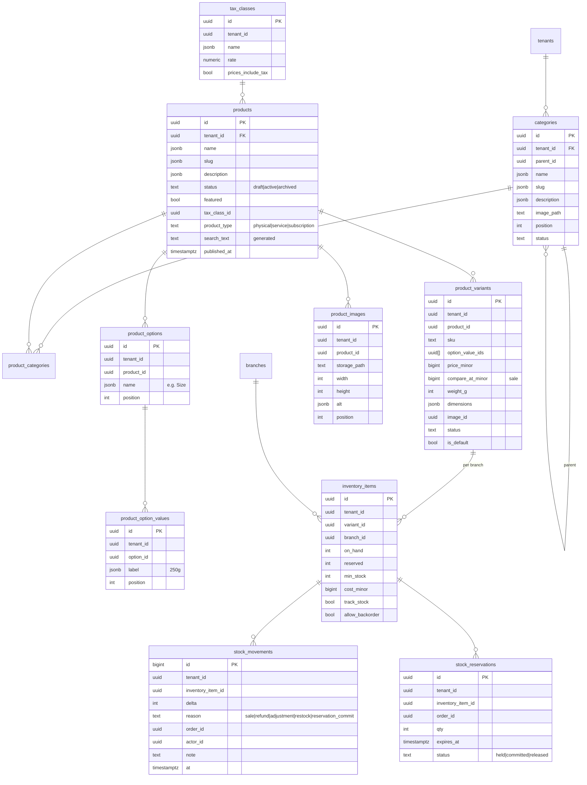
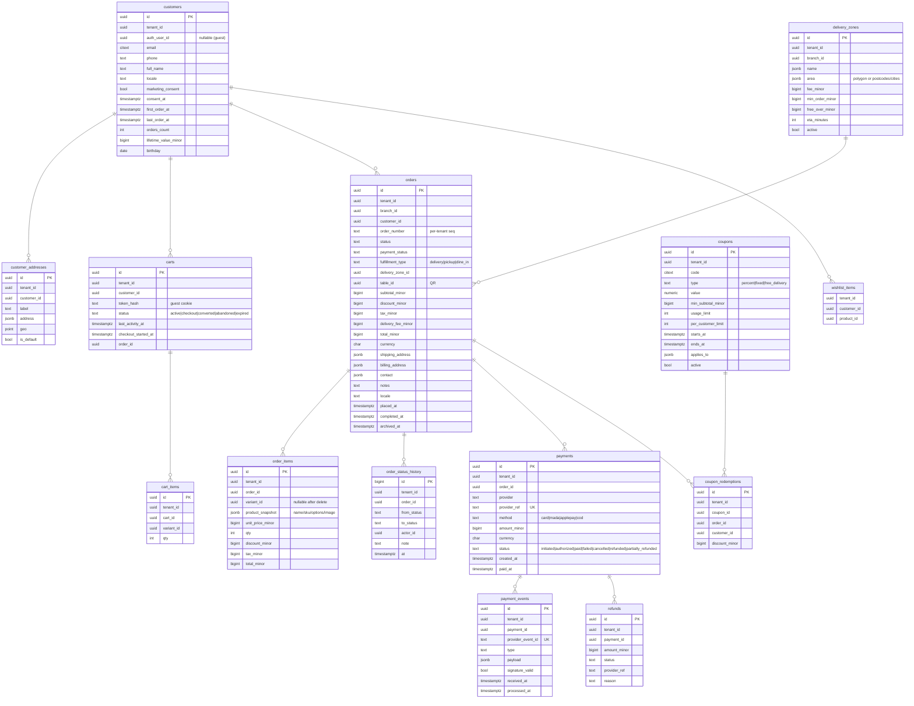
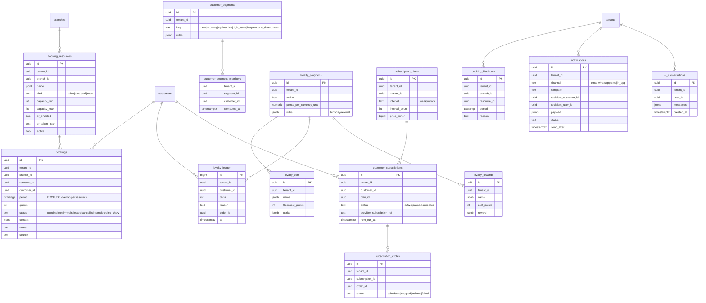

# SmartManager E-commerce — Architecture Plan (Phase 0)

Status: **Approved (2026-09-25) with one change: deployment on Hostinger instead of Cloudflare.** Platform domain: `e-commerce.smartmanager.me`. Phase 1 is implemented; see §17.
Date: 2026-09-25

---

## 1. Audit findings

| Area | Finding | Consequence |
|---|---|---|
| Git repository | Empty (no commits, no `package.json`, no code). | Greenfield. Nothing to preserve or migrate. |
| Supabase project | `E-commerce` (`yswvehtpwmzulgkvznnb`), region `ap-south-1`, Postgres 17, status healthy. No `public` tables, no migrations, no storage buckets, no auth users. | Clean database, so the schema can be designed properly from migration 0001. |
| Installed extensions | `pgcrypto`, `uuid-ossp`, `supabase_vault`, `pg_stat_statements` | Vault will hold tenant payment secrets. |
| Available extensions to enable | `pg_trgm`, `citext`, `btree_gist`, `pg_cron`, `pgmq`, `pgtap`, `unaccent` | Search, case-insensitive email, booking overlap constraints, scheduled jobs, queues, and DB security tests. |
| Other Supabase projects in org | `SmartManager Loyalty`, `Sales CRM`, `smartmanager-projects`, `Affiliate` | Not reused. Integration can come later through APIs; data is not shared across projects. |
| Environment variables | None configured (no Supabase URL/keys, DB password, payment, or Cloudflare credentials). | See §13, *Missing configuration*. |
| Tooling in dev container | Node 22, npm 10, pnpm 10, psql, Docker | Supabase CLI local stack + pgTAP tests + Playwright are all viable. |

**Conflicts found:** none (greenfield).
**Region note:** `ap-south-1` (Mumbai) is a reasonable latency choice for the Gulf. Supabase has no Middle East region. If data residency in KSA becomes a legal requirement, it will need a separate decision.

---

## 2. Technology decisions

| Concern | Decision | Why |
|---|---|---|
| Framework | **Next.js (App Router, latest stable) + React Server Components + TypeScript (strict)** | SSR/ISR for a fast, SEO-friendly storefront. Server Actions and Route Handlers serve as the server-side service layer. |
| Styling | **Tailwind CSS v4** with CSS-variable design tokens | Tokens are driven by the theme and tenant at runtime with no rebuild per tenant. Logical properties (`ms-*`, `pe-*`, `start-*`) give correct RTL. |
| i18n | **next-intl**, locale as a URL prefix: `/en/...`, `/fr/...`, `/ar/...` | SEO-correct (`hreflang`, canonical). Switching language keeps the same path and query, so page state is preserved. `<html lang dir>` is set per locale. |
| DB / Auth / Storage | **Supabase** (Postgres + RLS, Auth, Storage, Vault) via `@supabase/ssr` | Required by the spec. Cookie-based sessions. |
| Validation | **Zod** at every server boundary, plus DB constraints | The client is never trusted. |
| Data access | Typed **repositories** (`src/server/repositories/*`) with **services** above them (`src/server/services/*`). Generated Supabase types. | No business logic in components. |
| Deployment | **Hostinger Business — Node.js web app, ZIP upload** (confirmed). Hostinger runs `npm run build` / `npm start`; see `docs/DEPLOYMENT-HOSTINGER.md`. Each storefront hostname is attached once in hPanel (no wildcard SSL on Business). A VPS would enable fully automatic custom domains later: tenant custom domains need on-demand TLS (e.g. Caddy `on_demand_tls` with an `ask` endpoint that checks `tenant_domains`) and a wildcard certificate for `*.e-commerce.smartmanager.me` (DNS-01). | Approved change. Managed Hostinger Node.js hosting works for platform subdomains, but each custom domain would need manual setup in hPanel. |
| Background work | **pg_cron** (schedules) + **pgmq** (queues). A secured `/api/jobs/*` worker is triggered by a server cron (Hostinger cron / systemd timer) or by `pg_net` from pg_cron. | Abandoned carts, daily brief, retention, aggregates, and notifications. |
| Charts | Recharts (admin only; lazy-loaded) | Keeps storefront JS minimal. |
| Tests | **Vitest** (unit/service), **pgTAP** (RLS and cross-tenant, run with `supabase test db`), **Playwright** (E2E, mobile viewports, RTL) | Required by §6 and §44 of the spec. |
| AI assistant | Claude API with **tool use** over a fixed set of tenant-scoped query tools. The model never writes SQL. | Tenant isolation by construction (§11). |

---

## 3. System overview

```
                 roasters.com  coffeehouse.com  cafe.smartmanager.app  app.smartmanager.app
                        \            |               /                      |
                    Reverse proxy on Hostinger (TLS, on-demand certs)       |
                                     |                                      |
                         Next.js standalone Node server ---------------------+
                         ┌───────────────────────────────────────────────────────┐
  request ─► proxy.ts:   │ hostname → TenantResolver (cached) → x-tenant-id       │
                         │ locale detection → /[locale]                            │
                         ├───────────────────────────────────────────────────────┤
                         │ Storefront (RSC)   │ Tenant Admin    │ Super Admin     │
                         │ app/(store)/[loc]  │ app/(admin)/... │ app/(platform)  │
                         ├───────────────────────────────────────────────────────┤
                         │ Service layer (server-only): Catalog, Cart, Checkout,  │
                         │ Pricing, Orders, Payments, Inventory, Booking,         │
                         │ Loyalty, Analytics, Notifications, AI, Entitlements    │
                         ├───────────────────────────────────────────────────────┤
                         │ Repositories → Supabase client                         │
                         │   • user-scoped client (JWT → RLS enforced)            │
                         │   • service client (server-only, narrow use, audited)  │
                         └───────────────────────────────────────────────────────┘
                                     │                         ▲
                         Postgres (RLS on every tenant table)   │ webhooks (signed)
                         Storage (tenant-prefixed paths)        │
                         Vault (payment secrets)          Moyasar / Tap / Stripe
```

---

## 4. Multi-tenancy model

### 4.1 Isolation strategy
- **Shared schema, `tenant_id uuid NOT NULL` on every tenant-owned table**, with RLS enabled and **forced** on all of them.
- Composite foreign keys `(tenant_id, id)` on child tables, e.g. `order_items (tenant_id, order_id) → orders (tenant_id, id)`. The database therefore rejects rows that link across tenants, even from privileged code.
- RLS helpers are `SECURITY DEFINER`, `STABLE`, with a pinned `search_path`, in a private `app` schema that is not exposed through the API:
  - `app.is_super_admin()`: platform role from the `platform_admins` table.
  - `app.is_tenant_member(tenant_id)`
  - `app.has_tenant_role(tenant_id, roles text[])`
  - `app.has_permission(tenant_id, permission text)`: role→permission mapping lives in tables, so it is extendable.
  - `app.tenant_has_feature(tenant_id, feature_key)`: plan entitlement check.
  - `app.current_customer_id(tenant_id)`: maps `auth.uid()` to that tenant's customer row.
- Standard policy shape (staff):
  `USING (app.has_permission(tenant_id, 'orders.read'))` / `WITH CHECK (app.has_permission(tenant_id, 'orders.write'))`.
- Customer policy shape: `USING (customer_id = app.current_customer_id(tenant_id))`.
- **Super admin** access goes through explicit `OR app.is_super_admin()` clauses on the tables it needs, plus audit logging. There is no blanket bypass.

### 4.2 Identity model
- `auth.users` is shared by the whole Supabase project. A person can be:
  - **staff** of one or more tenants → `tenant_members (tenant_id, user_id, role_id, branch_id?)`
  - **customer** of one or more tenants → `customers (tenant_id, auth_user_id?, …)`. The row is per tenant. Guests have `auth_user_id = NULL`.
  - **platform admin** → `platform_admins (user_id)`
- Roles: `tenant_owner`, `admin`, `manager`, `staff` are seeded system roles. Permissions are rows (`permissions`, `role_permissions`). Tenants can later create custom roles (`roles.tenant_id` not null). `super_admin` is platform-level and never a tenant role.

### 4.3 Public (storefront) data exposure
- Base tables grant **no privileges to `anon`**, with one exception: catalog tables that hold only public fields (see below) get an `anon` SELECT policy limited to `status = 'active'` rows of `active` tenants.
- **Sensitive commercial fields are in separate tables that anon can never read**: cost and stock quantities live in `inventory_items`, not on `products`/`product_variants`. The storefront gets availability through `storefront_variant_availability(tenant_id, variant_ids[])`. This function returns `in_stock`/`low_stock`/`out_of_stock` and never exposes cost or exact stock.
- The storefront always filters by the `tenant_id` that **the server resolved from the hostname**, never by a value from the client.

### 4.4 Writes from the storefront
Cart, checkout, order creation, booking creation and payment initiation run **only in server code**. The tenant comes from the resolved host. Transactional Postgres functions do the work:
- `commerce.create_order_from_cart(...)` re-reads prices, variants, coupon rules, delivery zone and tax from the DB, recomputes every amount, and creates the order and its item snapshots atomically.
- `commerce.confirm_payment(payment_id, provider_payload)` is called **only by the webhook/verification path**. It marks the payment and order paid, converts stock reservations into deductions, awards loyalty points, and updates aggregates.
- These functions are `EXECUTE`-granted to `service_role` only.

---

## 5. Domain / tenant resolution

```
request → proxy (src/proxy.ts) → normalize host (lowercase, strip port, strip "www.")
        → TenantResolver.resolve(host)
             1. edge cache / in-memory LRU (TTL 60s, tag-invalidated on domain change)
             2. SELECT tenant_id FROM tenant_domains WHERE hostname = $1 AND verified
             3. fallback: "<slug>.<PLATFORM_ROOT_DOMAIN>" → tenants.slug
             4. dev only: "<slug>.localhost", or ?__tenant=<slug> when NODE_ENV !== 'production'
        → not found → platform marketing / 404 page (never another tenant's store)
        → tenant.status = suspended → "store unavailable" page
        → sets request header x-tenant-id (overwrites any client-supplied value)
```
- `tenant_domains (hostname unique, tenant_id, is_primary, verification_token, verified_at, ssl_status)`. Custom-domain TLS on Hostinger uses on-demand certificates gated by this table (Phase 15).
- The resolver is a server-only service with a narrow read-only query over `tenant_domains` and `tenants`. It does not use broad privileges.
- The **tenant admin** is served from a central host (`app.<platform domain>`) with a tenant switcher. Reasons: a single login for staff who belong to several tenants, auth cookies are never scoped to customer-facing custom domains, and admin is never exposed on tenant domains. Visiting `/admin` on a tenant domain redirects there. **Super admin** is `app.<platform domain>/platform`, gated by `platform_admins`. *(Decision point D1 below.)*

---

## 6. Money, locale and content conventions
- **Money is stored as `bigint` minor units** (halalas, cents, millimes) together with `currency char(3)`. Currency exponent comes from a `currencies` table (SAR/EUR/USD = 2, KWD/BHD/TND = 3). There are no floats anywhere.
- **Multilingual content** uses JSONB `{ "en": "...", "fr": "...", "ar": "..." }` for `name`, `description`, `slug` and similar fields. A CHECK constraint restricts keys to supported locales. Fallback order: requested locale → tenant default language → any available locale.
- Search: `pg_trgm` GIN index on a generated, `unaccent`ed text column that concatenates all locale names and SKUs. It works for Arabic (trigram, no stemming) and French (accent-insensitive).
- Timestamps are `timestamptz`. Business logic such as opening hours, "today" and daily briefs uses `tenants.timezone`.
- UI strings live in `messages/{en,fr,ar}.json` (next-intl). No user-facing text is hard-coded in components.

---

## 7. Database schema (ERD)

Schemas: `public` (API-exposed tables with RLS), `app` (private helpers), `commerce` (private transactional functions), `analytics` (aggregates).

### 7.1 Platform, tenancy and access

```mermaid
erDiagram
    plans ||--o{ plan_features : has
    features ||--o{ plan_features : "included in"
    plans ||--o{ tenant_subscriptions : ""
    tenants ||--o{ tenant_subscriptions : ""
    tenants ||--o{ tenant_feature_overrides : ""
    tenants ||--o{ tenant_domains : ""
    tenants ||--|| tenant_settings : ""
    tenants ||--|| storefront_configs : ""
    tenants ||--o{ branches : ""
    tenants ||--o{ tenant_members : ""
    roles ||--o{ role_permissions : ""
    permissions ||--o{ role_permissions : ""
    roles ||--o{ tenant_members : ""
    profiles ||--o{ tenant_members : ""
    profiles ||--o| platform_admins : ""
    tenants ||--o{ payment_provider_configs : ""
    tenants ||--o{ audit_logs : ""

    tenants {
      uuid id PK
      text slug UK
      text business_name
      text business_type "cafe|restaurant|retail|salon|spa|gym|other"
      text status "active|suspended|onboarding|closed"
      char currency
      text timezone
      text default_language
      text[] enabled_languages
      text country
      text city
      jsonb address
      text phone
      citext email
      text logo_path
      text favicon_path
      jsonb description
      timestamptz created_at
      timestamptz updated_at
    }
    tenant_domains {
      uuid id PK
      uuid tenant_id FK
      text hostname UK
      bool is_primary
      timestamptz verified_at
    }
    tenant_settings {
      uuid tenant_id PK
      jsonb checkout
      jsonb delivery
      jsonb booking
      jsonb notifications
      jsonb retention
      jsonb tax
      jsonb consent
    }
    storefront_configs {
      uuid tenant_id PK
      text theme_key
      jsonb tokens
      jsonb header
      jsonb homepage_sections
      jsonb seo
    }
    branches {
      uuid id PK
      uuid tenant_id FK
      jsonb name
      jsonb address
      jsonb opening_hours
      bool is_default
    }
    profiles {
      uuid id PK "= auth.users.id"
      text full_name
      text phone
      text preferred_language
    }
    platform_admins {
      uuid user_id PK
      text level
    }
    roles {
      uuid id PK
      uuid tenant_id "NULL = system role"
      text key
      jsonb name
    }
    permissions {
      text key PK
      text module
    }
    role_permissions {
      uuid role_id FK
      text permission_key FK
    }
    tenant_members {
      uuid tenant_id FK
      uuid user_id FK
      uuid role_id FK
      uuid branch_id "nullable"
      text status
    }
    plans {
      uuid id PK
      text key UK
      jsonb name
      bigint price_minor
      char currency
      text interval
      bool is_public
    }
    features {
      text key PK
      text module
      text kind "boolean|limit"
    }
    plan_features {
      uuid plan_id FK
      text feature_key FK
      bool enabled
      int limit_value
    }
    tenant_subscriptions {
      uuid id PK
      uuid tenant_id FK
      uuid plan_id FK
      text status
      timestamptz current_period_end
    }
    tenant_feature_overrides {
      uuid tenant_id FK
      text feature_key FK
      bool enabled
      int limit_value
    }
    payment_provider_configs {
      uuid id PK
      uuid tenant_id FK
      text provider
      text mode "test|live"
      jsonb public_config
      uuid secret_vault_id
      text[] methods
      bool is_active
    }
    audit_logs {
      bigint id PK
      uuid tenant_id
      uuid actor_id
      text action
      text entity
      uuid entity_id
      jsonb diff
      inet ip
      timestamptz at
    }
```



### 7.2 Catalog and inventory



A product without options has exactly one default variant, so price and SKU always live on variants and there is only one code path. Sale price is `compare_at_minor` (original) versus `price_minor` (current).

### 7.3 Customers, carts, orders and payments



`promotions` (automatic discounts: rules plus `jsonb` conditions and actions) sits next to `coupons` and shares the same pricing engine.

### 7.4 Booking, loyalty, subscriptions, marketing and operations



The overlap guarantee `EXCLUDE USING gist (resource_id WITH =, period WITH &&) WHERE status IN ('pending','confirmed')` (needs `btree_gist`) makes double-booking impossible at the database level. Other operational tables: `marketing_campaigns`, `abandoned_cart_rules`, `communication_consents`, `order_exports`, `tenant_counters` (per-tenant order numbers), `currencies`.

### 7.5 Analytics aggregates (schema `analytics`)
- `daily_sales (tenant_id, branch_id, day, orders, revenue_minor, discount_minor, tax_minor, new_customers, returning_customers, aov_minor)`
- `daily_product_sales (tenant_id, day, product_id, variant_id, qty, revenue_minor)`
- `daily_category_sales`, `daily_bookings`, `daily_coupon_usage`
- **Maintenance:** incremental upsert inside `confirm_payment`, refund and cancel, plus a nightly pg_cron reconcile for the previous 2 days. Dashboards read aggregates only; "today" is computed live from indexed `orders(tenant_id, placed_at)`.
- The aggregates **survive order archival/deletion**, which is what makes the retention policy (§28 of the spec) safe.

### 7.6 Retention (spec §28)
`tenant_settings.retention = { archive_after_days, delete_after_days, require_export: true }`.
Lifecycle: active → `archived_at` set (hidden from operational lists, still exportable) → export generated (`order_exports`, file in private storage) → hard delete only after `delete_after_days`, only if an export exists, and always with an audit log row. Nothing is deleted if either value is null (the default).

---

## 8. Storage
- Buckets: `tenant-public` (product and brand images, public read) and `tenant-private` (exports, invoices; signed URLs only).
- Path convention: `{tenant_id}/{kind}/{uuid}.{ext}`. Storage RLS checks `(storage.foldername(name))[1]::uuid` against `app.has_permission(..., 'media.write')`.
- Image pipeline: the original is uploaded server-side after validation (mime sniffing, size limit). Responsive AVIF/WebP delivery uses the built-in `next/image` optimizer (sharp) running on the Hostinger Node server, with its cache on local disk. Thumbnails are generated at upload time. This replaces D4 (Cloudflare Images) after the move to Hostinger.

---

## 9. Payments

```ts
interface PaymentProvider {
  key: 'moyasar' | 'tap' | 'stripe' | 'cod';
  supportedMethods(cfg): PaymentMethod[];              // card, mada, applepay, stcpay...
  createPayment(input: CreatePaymentInput, secrets): Promise<ProviderPaymentSession>;
  fetchPayment(ref: string, secrets): Promise<ProviderPaymentStatus>;   // server-side verification
  verifyWebhook(req: RawRequest, secrets): Promise<VerifiedEvent>;      // signature check
  refund(ref: string, amountMinor: bigint, secrets): Promise<RefundResult>;
  applePay?: { domainAssociation(cfg): string };        // served at /.well-known/...
}
```
- `PaymentService` picks the tenant's active `payment_provider_configs` row. Secrets are read from **Supabase Vault** by a `service_role`-only function, in server code only.
- Flow: checkout → `create_order_from_cart` (status `pending_payment`, stock reserved with a 15-minute expiry) → `createPayment` → provider-hosted or official SDK form (Moyasar.js / Apple Pay via the provider) → redirect back. **The return page only displays status.** It calls `fetchPayment` server-side, while the webhook also arrives (`/api/webhooks/payments/[provider]/[configId]`). Both paths call the idempotent `confirm_payment`, keyed on `provider_event_id` / `provider_ref` plus an amount and currency match check.
- Failure, cancel or expiry releases reservations. A pg_cron job sweeps expired reservations.
- **First provider: Moyasar** (KSA, SAR, Mada, Apple Pay, STC Pay). Tap and Stripe are adapters behind the same interface. *(Decision point D2.)*
- Apple Pay is enabled only when the provider supports it and domain verification is done per tenant domain. No fake buttons.
- Card data never touches our servers (provider-hosted fields/tokenization).

---

## 10. Theme engine and design system
- **Design tokens** (`src/design/tokens.ts` → CSS variables): color roles (`--color-bg`, `--color-fg`, `--color-primary`, `--color-accent`, `--color-muted`, `--color-border`, …), type scale, font families (Latin and Arabic pairing per theme, e.g. serif display + IBM Plex Sans Arabic / Noto Naskh), spacing scale, radius scale, shadows, motion durations.
- **Theme** = `{ key, tokens, fonts, variants: { header, hero, productCard, button }, defaultSections }`. It is registered in `src/themes/registry.ts`. The five themes are `premium-cafe`, `modern-restaurant`, `modern-retail`, `luxury` and `beauty`. New themes are added through registration only.
- **Tenant overrides** come from `storefront_configs.tokens` and are merged over the theme defaults, validated with Zod (colors are checked for WCAG contrast before saving).
- **Homepage** = an ordered array of `{ type, enabled, variant, props }` validated against a section registry (hero, featured-categories, best-sellers, featured-products, promo-banner, brand-story, collection, reviews, loyalty, newsletter, location, booking-cta). Admins reorder and toggle sections.
- Components: headless primitives (Radix UI for dialog, drawer, popover, select and focus-trap accessibility) with our own styling. No generic UI kit look.

---

## 11. AI business assistant (architecture; built in Phase 13)
- Route handler → authenticate the staff user → resolve the active tenant from the session membership (**never from the prompt**) → Claude with a fixed toolset: `get_sales_summary(range)`, `top_products(range, limit)`, `low_stock()`, `inactive_customers(days)`, `compare_periods(a, b)`, `category_performance(range)`.
- Each tool runs through the **user-scoped Supabase client**, so RLS applies. The tenant is bound in the closure; the model cannot choose it. Tool output is aggregate-first, and PII is minimized.
- The model only drafts promotion ideas. Creating a promotion requires explicit admin confirmation in the UI.
- Gated by the `ai_assistant` feature entitlement. Usage is logged per tenant.

---

## 12. Security checklist (built into Phase 1–2, verified in Phase 14)
- RLS enabled and **forced** on every `public` table. A CI check fails if any table lacks RLS.
- pgTAP suite: for each tenant-owned table, Tenant A's owner/staff/customer cannot SELECT, INSERT, UPDATE or DELETE Tenant B's rows. Anon cannot read private tables. Tenant staff cannot touch `platform_*` tables. Composite foreign keys reject cross-tenant links.
- The service-role key is only imported in modules marked `import 'server-only'`. An ESLint rule blocks `SUPABASE_SERVICE_ROLE_KEY` from any client file, and env validation (`@t3-oss/env-nextjs` + Zod) separates server and client variables.
- Price, discount, tax, stock, tenant, role and payment status are always computed or read server-side.
- Webhook signature verification plus idempotency; rate limiting on auth, checkout, booking and coupon endpoints (reverse-proxy rate limiting plus an application/DB-backed limiter; Supabase Auth already rate-limits sign-in).
- Security headers (CSP with provider allowlist, HSTS, frame-ancestors, referrer-policy); SameSite=Lax, HttpOnly, Secure cookies; Server Actions' built-in origin check for CSRF, plus an origin check on route handlers.
- Audit log for admin writes (DB triggers on sensitive tables plus service-level events).

---

## 13. Missing configuration / credentials

| Item | Needed by | Notes |
|---|---|---|
| `NEXT_PUBLIC_SUPABASE_URL` = `https://yswvehtpwmzulgkvznnb.supabase.co` | Phase 1 | Known. |
| Supabase publishable (anon) key | Phase 1 | Retrievable through the Supabase MCP. |
| **Supabase service-role / secret key** | Phase 1 (server) | **Must be provided** as an environment secret. The MCP cannot reveal it, and it will not be committed. |
| DB connection string / password | Local migration tooling (optional) | Migrations can be applied through the Supabase MCP instead. |
| Platform root domain (e.g. `smartmanager.app`) | Phase 2 | For `<slug>.<root>` subdomains and the admin host. |
| Moyasar test keys (publishable + secret + webhook secret) | Phase 6 | Per tenant; stored in Vault. |
| Apple Pay merchant/domain setup | Phase 6 | Through the provider. |
| Email provider (Resend is connected to this workspace) + sending domain | Phase 7 | Order notifications, daily brief. |
| WhatsApp Business provider | Phase 10 (optional) | Architecture only until credentials exist. |
| Anthropic API key | Phase 13 | Server-only. |
| Hostinger plan details (VPS recommended), SSH/deploy access, DNS for `e-commerce.smartmanager.me` and `*.e-commerce.smartmanager.me` | Phase 15 | Wildcard DNS + certificate; on-demand TLS for custom domains. |
| Supabase plan (image transformations and PITR backups need Pro) | Phases 4/15 | |

---

## 14. Repository layout (target)

```
/
├─ src/
│  ├─ app/
│  │  ├─ (store)/[locale]/...          storefront: home, shop, product/[slug], cart, checkout, account, book
│  │  ├─ (admin)/[locale]/admin/...    tenant admin
│  │  ├─ (platform)/[locale]/platform/ super admin
│  │  └─ api/ (webhooks, jobs, health)
│  ├─ proxy.ts                         tenant + locale resolution (Next.js 16 "proxy")
│  ├─ i18n/ (routing, request config)   messages/{en,fr,ar}.json at root
│  ├─ design/ (tokens, primitives)      components/{ui,store,admin}/
│  ├─ themes/ (registry + 5 themes)     sections/ (homepage section registry)
│  ├─ server/ (server-only)
│  │  ├─ supabase/ (user client, service client)
│  │  ├─ tenant/ (resolver, context)
│  │  ├─ repositories/   services/   payments/providers/
│  │  └─ env.ts
│  └─ lib/ (money, locale, zod schemas, shared types)
├─ supabase/
│  ├─ config.toml
│  ├─ migrations/0001_… .sql
│  ├─ seed.sql                          Tenant A (café), Tenant B (retail) dev data
│  └─ tests/*.test.sql                  pgTAP RLS / isolation tests
├─ tests/ (vitest unit, playwright e2e)
└─ docs/ (ARCHITECTURE.md, decisions/ADR-*.md, RUNBOOK.md)
```

---

## 15. Phase 1 — Foundation (proposed plan)

**Build:** Next.js + TypeScript (strict) + Tailwind v4 scaffold; design tokens; next-intl with en/fr/ar and RTL; Supabase clients (browser/server/service) and env validation; auth foundation (email+password and magic link, session middleware); tenant resolver; storefront shell (header, footer, language switcher, theme token injection); admin shell (sidebar nav driven by entitlements, empty states); CI scripts (typecheck, lint, test, RLS check).

**Migrations:**
1. `0001_extensions_and_private_schemas.sql`: `pg_trgm`, `citext`, `btree_gist`, `unaccent`; `app`, `commerce` and `analytics` schemas; shared `updated_at` trigger.
2. `0002_platform_and_tenancy.sql`: `currencies`, `tenants`, `tenant_domains`, `tenant_settings`, `storefront_configs`, `branches`, `profiles` (+ auth trigger), `platform_admins`, `roles`, `permissions`, `role_permissions`, `tenant_members`.
3. `0003_plans_and_entitlements.sql`: `features`, `plans`, `plan_features`, `tenant_subscriptions`, `tenant_feature_overrides`.
4. `0004_rls_helpers_and_policies.sql`: `app.*` helper functions and RLS policies for the tables above.
5. `0005_audit_log.sql`
6. `seed.sql`: system roles and permissions, features, three plans (Starter/Business/Professional as data), Tenant A “Roasters Café” (`roasters.localhost`), Tenant B “Coffeehouse” (`coffeehouse.localhost`), dev users.
7. `supabase/tests/0001_tenancy_isolation.test.sql` (pgTAP).

**Dependencies:** `next`, `react`, `react-dom`, `typescript`, `tailwindcss`, `@tailwindcss/postcss`, `next-intl`, `@supabase/supabase-js`, `@supabase/ssr`, `zod`, `@t3-oss/env-nextjs`, `server-only`, `@radix-ui/react-*` (as needed), `clsx`, `tailwind-merge`; dev: `eslint`, `eslint-config-next`, `prettier`, `vitest`, `@playwright/test`, `supabase` (CLI).

Catalog, orders and the other domain tables are **not** created in Phase 1. They arrive in their own phases, with the ERD above as the target.

---

## 16. Decision points for approval

- **D1: Admin host.** Proposed: central `app.<platform domain>` for tenant admin and `/platform` for super admin, with `/admin` on tenant domains redirecting there. Alternative: admin on each tenant domain.
- **D2: First payment provider.** Proposed: **Moyasar** (KSA-native, Mada + Apple Pay + STC Pay). Alternatives: Tap, Stripe.
- **D3: URL locale prefix.** Proposed: always prefixed (`/ar/...`), with the default locale redirected from `/` by tenant default and `Accept-Language`.
- **D4: Image transformations.** ~~Cloudflare Images~~ → built-in `next/image` optimizer on the Hostinger Node server (follows from the Hostinger decision).
- **D5: Branches.** Proposed: every tenant gets a hidden default branch, so branch-scoped data is uniform. Multi-branch UI appears only with the entitlement.
- **D6: Database workflow.** Proposed: migrations are versioned in `supabase/migrations`, tested locally with the Supabase CLI (Docker) plus pgTAP, then applied to the `E-commerce` project through the Supabase MCP. The remote project is treated as dev/staging; production gets a separate project in Phase 15.

---

## 17. Phase 1 implementation notes

**Hosts** (configurable with `PLATFORM_ROOT_DOMAIN` / `CONSOLE_SUBDOMAIN`):

| Host | Area | Internal route |
|---|---|---|
| `e-commerce.smartmanager.me` | Platform site | `/site/[locale]/…` |
| `app.e-commerce.smartmanager.me` | Tenant admin console + Super Admin (`/platform`) | `/console/[locale]/…` |
| `<slug>.e-commerce.smartmanager.me` | Storefront (tenant by slug) | `/store/[tenant]/[locale]/…` |
| any verified custom domain | Storefront (tenant by `tenant_domains`) | `/store/[tenant]/[locale]/…` |
| development | `localhost:3000`, `app.localhost:3000`, `<slug>.localhost:3000` | same |

- `src/proxy.ts` is the only place where hostname → area/tenant is decided. It strips client-supplied internal headers (`x-tenant-id`, …) and rewrites to internal routes. Visitors cannot address `/store/<other-tenant>` directly, because every path is prefixed by the proxy. Redirects are built from the visitor's `Host` header and `X-Forwarded-Proto`, so they stay correct behind Hostinger's reverse proxy.
- Locale: the URL prefix is authoritative. Without one, the proxy picks the `NEXT_LOCALE` cookie, then `Accept-Language`, then the tenant default, always restricted to the tenant's enabled languages.
- App Router layouts and pages render in parallel, so every console page calls `requireTenantAdmin()` itself; access checks are never left only to a layout.
- Themes: `src/themes/definitions.ts` (5 themes), `src/themes/tokens.ts` (CSS variables, validated tenant overrides, automatic contrast-safe `*-text` colours and readable foregrounds).

**Database migrations:** `supabase/migrations/20260925000001…07`. They are applied to the hosted dev project with the same SQL, and the two dev tenants are seeded there (no users).

**Tests:**
- `npm run test:db`: pgTAP (59 assertions) covering RLS coverage, privileges, and cross-tenant isolation for owner/manager/staff/outsider/anon/platform admin.
- `npm test`: Vitest (hosts, locales, money, localisation, themes/contrast, module visibility, translation parity).
- `npm run test:e2e`: Playwright (desktop, Android-size and iPhone-size viewports; RTL, tenant isolation, SEO tags, axe accessibility).

---

## 18. Phase 2 implementation notes (multi-tenancy management)

**Migration `20260926000008_tenant_management`:**
- `tenant_invitations`: 256-bit tokens, stored only as SHA-256 hashes (clients cannot read `token_hash`), 7-day expiry, one open invitation per email per tenant, audited.
- `invite_member` / `revoke_invitation` / `get_invitation` (anon, token-gated) / `accept_invitation` (the signed-in user's email must match). The `max_staff` entitlement counts active members plus open invitations, and is also enforced when a disabled member is re-enabled.
- Only owners can invite owners, and admins with `staff.write` can invite other roles. Membership changes stay owner-only (RLS plus the last-owner guard).
- Platform RPCs (Super Admin only, checked inside): `platform_create_tenant` (tenant, trial subscription and owner invitation in one transaction), `platform_set_plan`, `platform_invite_owner`.
- Custom domains: tenants with `settings.write` and the `custom_domain` entitlement can request unverified domains only. Verification is a server-side DNS TXT check (`_smartmanager-verify.<host>`), recorded by `record_domain_check` (service role only, with the actor attributed in the audit log). `hosting_connected_at` tracks the manual hPanel step.
- Storage: public bucket `tenant-public` (5 MB, raster images only). Writes are limited to `<tenant_id>/…` folders for members holding `media.write`/`appearance.write`. Uploads are re-encoded with sharp; SVG is rejected.

**Console modules:** Settings (profile, languages, contact, domains), Appearance (theme, contrast-checked colours, logo/favicon), Staff (invite, roles, disable, remove), invitation acceptance, and Super Admin (create business, status, plan, per-tenant feature overrides, hostname checklist, owner re-invite). Each page enforces permission and entitlement itself (`ModuleGate`); Server Actions re-check with `actionContext()`, and the database enforces RLS as the last line.

**Email:** no provider is configured yet (Phase 7), so invitation links are shown to the inviter to share. Invitees create their account through the invitation (created server-side for the invited email only).
